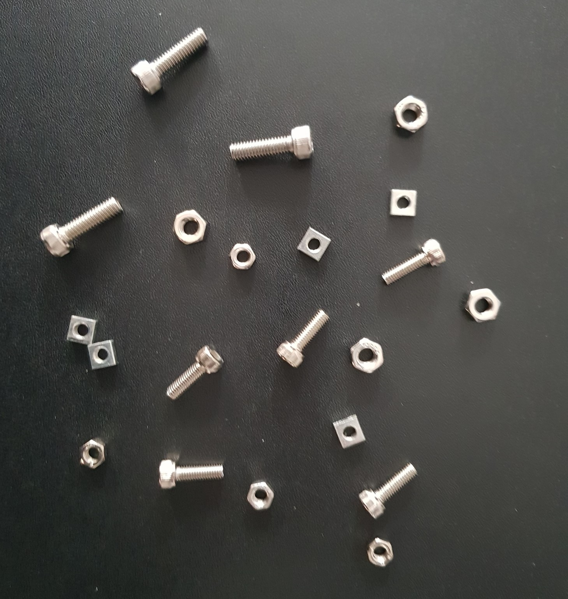
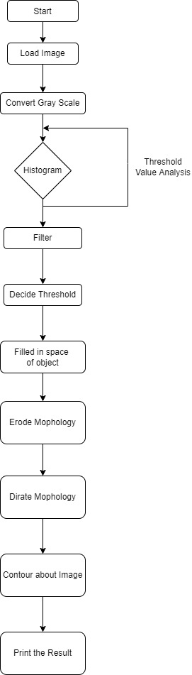
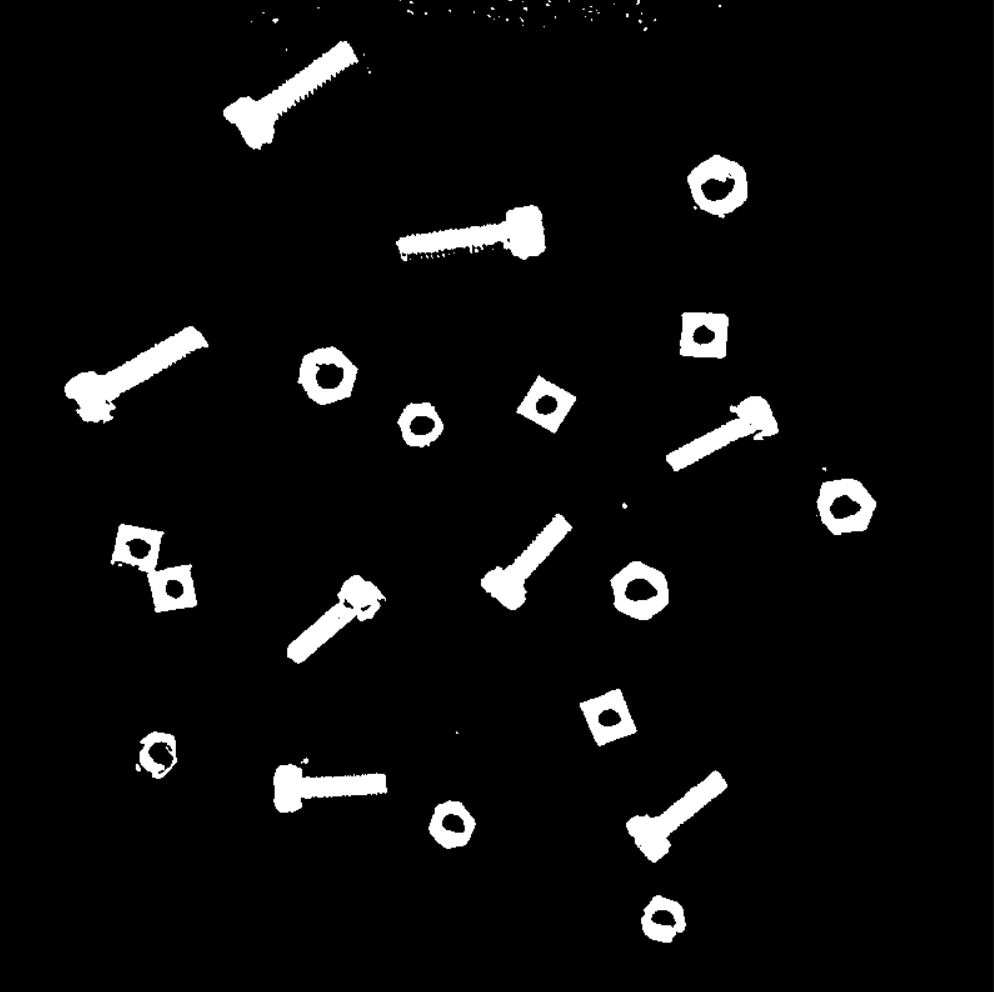
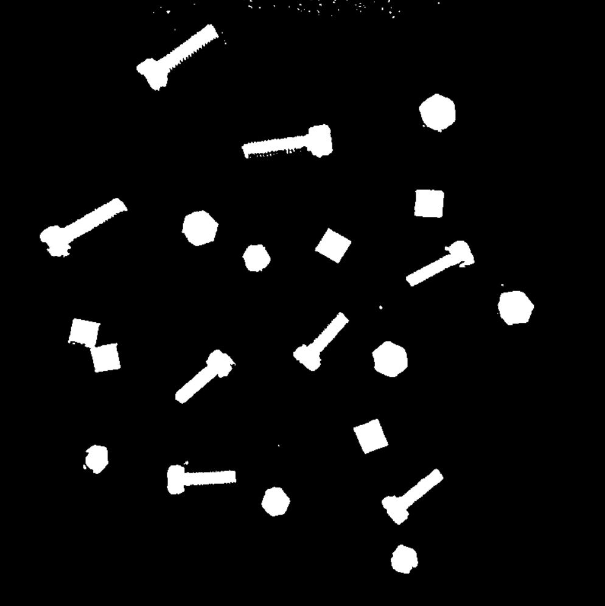
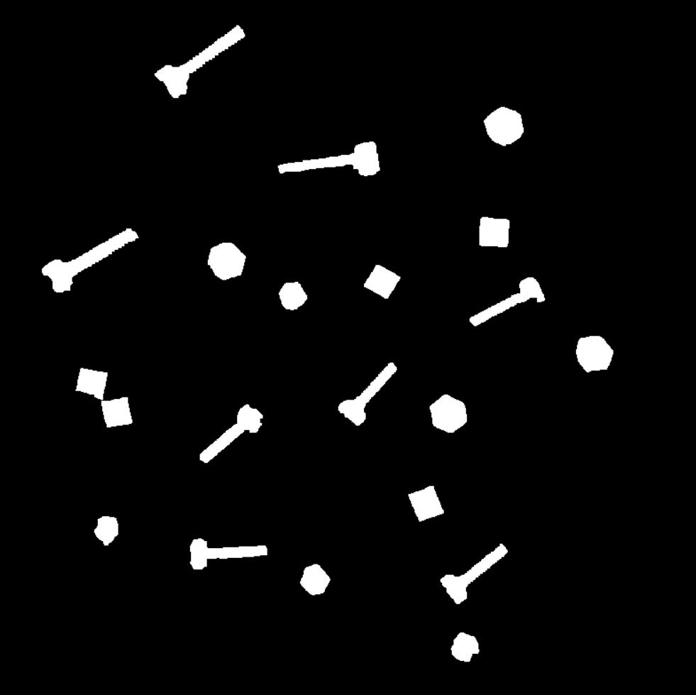
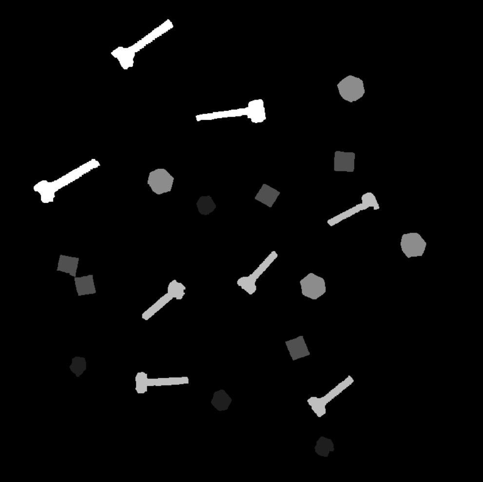
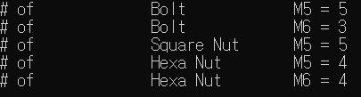

# LAB: Grayscale Image Segmentation

Name:  					ChangMin An

Student Number:   21700421

Program: 				C/C++

IDE/Compiler: 		Visual Studio 2019

OS: 						   Win10


## I. Introduction

**Goal**: Count the number of nuts & bolts of each size for smart factory

There are 2 different size bolts and 3 different types of nuts. We are required to segment the object and count each parts. 

* Bolt M5
* Bolt M6
* Square Nut M5
* Hexa Nut M5
* Hexa Nut M6


**Figure #1. GrayScale TestImage**




After analyzing histogram, applying thresholding and morphology, we can identify and extract the target objects from the background by finding the contours around the connected pixels. By distinguishing each component in this way, the component can be identified for each image, and application for image processing is possible accordingly.


## II. Procedure

We proceeded with image processing through the following steps. This is to distinguish between the bottom surface and the bolt, nut, and appropriate filters, thresholding, and morphology are implemented through histogram analysis. The procedure of the experiment is as follows.

* Select the appropriate filter to remove noise, etc. Kernel size should be appropriately selected.
* Use histogram to determine the threshold. Decide that only the objects to be detected appear.
* Use the contours to fill the inside of the object surrounded by the border with while.
* Do erode and dirate several times to remove noise and drop objects attached to each other.
* Measure the Area and Length of each object using contours.
* Categorize the types of parts according to the range of Area and Length and count the number.


## III. Flow Chart




## IV. Experiment

### 1. Histogram

Replace with the gray scale of the image and analyze the histogram. After analyzing the histogram, the appropriate filter is designated. The reason for analyzing the histogram is to separate the image through black-and-white processing, leaving only the objects we want to extract. However, it is important to set an appropriate value because increasing the threshold value to eliminate excessive noise disconnects objects.

 The figure below is a histogram of Raw Data and a histogram of filtered data. The following picture shows that the distribution of scale is more clearly distinguished between the color of the floor the object when using the median filter. In addition, it is possible to perform cleaner image processing by filtering noise first through a median filter. 

**Figure #2. Histogram of Raw Figure**


**Figure #3. Histogram of Median Filter, Kernel Size: 5**


### 2. Threshold

The histogram is analyzed for the output matrix obtained using the median filter and an appropriate threshold is designated. At this time, threshold is selected so that the object that we need to recognize should not be broken because the object should be recognized using content. Noise caused by lighting cannot be completely filtered out. However, in the case of sporadic noise, not lumpy, some of the morphology techniques can be eliminated through error, so be careful not to erase all noise with threshold. In this figure below, threshold value is 116, and the threshold method is Binary method.

In the picture below, the hexagonal Nut below the left is designed to be attached as much as possible, and it can be seen that noise exists in the top. When selecting threshold, all objects are selected to minimize noise without breaking.

**Figure #4. Thresholding Figure**



------


### 3. Filled Object

If morphology is used immediately after thresholding, some objects are greatly distorted and objects cannot be distinguished. Since the principle of contour is recognized as an object if the edges are connected, it is necessary to fill the object before proceeding with the contour. The picture below is a failed object. The difference from the picture above is that it fills objects such as holes. Through this, it can be seen that it is more advantageous to grasp the number of contents used.

**Figure #5 Filled Object**




### 4. Morphology

If we look at the pictures that have been filled, there are a pair of square nuts attached, so when we count the the number of objects. The morphology technique used the error technique to remove the noise remaining in the figure and separate the number of objects that are difficult to grasp the morphology technique is used. In addition, since the size of the object has become smaller due to the error, the size is supplemented by the dirate technique to eliminate noise and restore the size of the existing object as much as possible. In the case of this figure, we proceed with Erode 5 times and Dirate 2 times.

**Figure #6. Morphology**




### 5. Contour

An object filled through the concept is recognized as one object, respectively, and Area of Contours and Length are output for it. In this case, Nut and Bolt are classified using the Area and length. At this time, bolts and nuts are classified using length and area. For M6 bolt, the criteria are area 6000 or higher and Length 300 or highter, and for M5 bolts, Area 4000 or higher and Length 300 or higher. In the case of nuts, Area 4000 or more is divided into hexagonal nuts M6, 2900 or more into square nuts M5, and the rest are divided into M4. For each part, the bright value is adjusted to verify whether it is correctly recognized.

**Figure #7. Contour Sorting Result**




## V. Analysis

#### 1. Filled Object

Thresholding an object can reduce noise, on the other hand, there is a possibility that the object we are analyzing is damaged. To compensate for this, filling in the empty space of objects before proceeding with morphology can reduce the impact on the number of contours when the object is broken.


#### 2. Morphology

When doing morphology, we have to be careful when deciding whether to do dirate first or erode first. The error is excellent in terms of eliminating noise, but it is highly likely to damage the shape of the existing object. In other words, it can be seen that the noise should be eliminated with the error and then the size of the existing object should be restored by proceeding with the duration.


## VI. Result




## VII. Conclusion

Histogram is analyzed to select an appropriate filter, and based on this, image processing is performed to analyze only the objects we want using the threshold technique. After that, post processing is performed to fill the empty space of the object and correct noise or distortion using morphology techniques so that the image can be analyzed more reliably. It can be seen that various applications can be implemented through this image processing.


## VIII. Appendix

### main.cpp

```c++
#include <iostream>
#include <opencv2/opencv.hpp>
#include "opencv2/highgui.hpp"
#include "opencv2/imgcodecs.hpp"
#include "opencv2/imgproc.hpp"
using namespace std;
using namespace cv;

// Define the Value
#define KERNEL_SIZE 5
#define THRESHOLD_VALUE 116

enum Filter_Mode {
	BLUR = 1, GAUSSIAN, MEDIAN, LAPLACIAN, DEFAULT
};

// Declare Global Variable
Mat src, src_gray, src_filtered, dst, dst_morph;
int gray = 255;
int Bolt_M5 = 0, Bolt_M6 = 0, Square_Nut_M5 = 0, Hexa_Nut_M5 = 0, Hexa_Nut_M6 = 0;

// Declare window-print name
String raw_data = "Raw_Data";
String result = "Result";

// Define Function
void Image_Processing(void);
void Convert_Gray(Mat& _src, Mat& _dst);
void Print_Window(String& _message, Mat& _src);
void Filter_Process(Mat& _src, Mat& _dst, int _filter, int _kernel);
void Threshold_Process(Mat& _src, Mat& _dst, int _thresValue);
void Contour_Process(Mat& _src, bool _flag);
void Morphology_Process(Mat& _src, Mat& _dst);
void Print_Result(void);

/*================= Main Loop ==================*/
void main(void)
{
	// Load an image
	src = imread("Lab_GrayScale_TestImage.jpg", IMREAD_COLOR);

	// Process the image
	Image_Processing();

	// Print the result about Bolt & Nut
	Print_Result();

	// Print the Window about sorting result (break for ESC)
	while (true)
	{
		Print_Window(result, dst_morph);
		
		int key = waitKey(20);
		if (key == 27)	break;
	}
}

/*================= Function ==================*/

// Image Process about Bolt & Nut
void Image_Processing(void)
{
	// Convert the image to Gray
	Convert_Gray(src, src_gray);
    
    // Print the gray scale image
	Print_Window(raw_data, src_gray);
    
    // Use Median-Filter & kernel_size = 5
	Filter_Process(src_gray, src_filtered, MEDIAN, KERNEL_SIZE);
    
    // Threshold process in threshold-value = 116 					
	Threshold_Process(src_filtered, dst, THRESHOLD_VALUE);		
    
    // Fill in the empty space of an object
	Contour_Process(dst, true);		
    
    // Morphology process (Erode: 5-times, Dirate: 2-times)
	Morphology_Process(dst, dst_morph);			
    
    // Counting each object and Distinguishing object to use brightness (Area, arcLength)
	Contour_Process(dst_morph, false);								
}

/* Convert the image to Gray
* _src: Input Matrix
* _dst: Output Matrix
*/
void Convert_Gray(Mat& _src, Mat& _dst)
{
	cvtColor(_src, _dst, CV_BGR2GRAY);
}

/* Print the gray scale image
* _message: Title
* _src: wanted to print matrix
*/
void Print_Window(String& _message, Mat& _src)
{
	namedWindow(_message, 0);
	resizeWindow(_message, Size(800, 800));
	imshow(_message, _src);
}

/* Filter Processing
* _src:		Input Matrix
* _dst:		Output Matrix
* _filter:	Type of Filter
* _kernel:	Kernel Size
*/
void Filter_Process(Mat& _src, Mat& _dst, int _filter, int _kernel)
{
	if		(_filter == BLUR)
        blur(_src, _dst, cv::Size(_kernel, _kernel), cv::Point(-1, -1));
	else if (_filter == GAUSSIAN)
        GaussianBlur(_src, _dst, cv::Size(_kernel, _kernel), 0, 0);
	else if (_filter == MEDIAN)	
        medianBlur(_src, _dst, _kernel);
}

/* Threshold Processing
* _src:			Input Matrix
* _dst:			Output Matrix
* _thresValue:	Threshold Value
*/
void Threshold_Process(Mat& _src, Mat& _dst, int _thresValue)
{
	threshold(_src, _dst, _thresValue, 255, 0);
}

/* Contour Processing
* _src:		Input Matrix
* _flag:	true(contour)/false(counting and color)
*/
void Contour_Process(Mat& _src, bool _flag)
{
	vector<vector<Point>> contours;
	int gray = 255;

	/// Find contours
	findContours(_src, contours, CV_RETR_EXTERNAL, CV_CHAIN_APPROX_SIMPLE, Point(0, 0));

	/// Draw all contours excluding holes
	Mat drawing(_src.size(), CV_8U, Scalar(0));

	Bolt_M5 = 0, Bolt_M6 = 0, Square_Nut_M5 = 0, Hexa_Nut_M5 = 0, Hexa_Nut_M6 = 0;
	for (int i = 0; i < contours.size(); i++)
	{
		if (!_flag)
		{
			if (contourArea(contours[i]) > 6000.0)
			{
				Bolt_M6++;
				gray = 255;
			}
			else if (contourArea(contours[i]) > 4000.0 && arcLength(contours[i], false) > 300.0)
			{
				Bolt_M5++;
				gray = 190;
			}
			else if (contourArea(contours[i]) > 4000.0 && arcLength(contours[i], false) <= 300.0)
			{
				Hexa_Nut_M6++;
				gray = 140;
			}
			else if (contourArea(contours[i]) > 2900.0)
			{
				Square_Nut_M5++;
				gray = 80;
			}
			else
			{
				Hexa_Nut_M5++;
				gray = 30;
			}
		}
		drawContours(drawing, contours, i, Scalar(gray), CV_FILLED, 8);
	}
	drawing.copyTo(_src);
}

/* Morphology processing
* _src:	Input Matrix
* _dst:	Output Matrix
*/
void Morphology_Process(Mat& _src, Mat& _dst)
{
	int element_shape = MORPH_RECT;
	int n = 3;
	Mat element = getStructuringElement(element_shape, Size(n, n));
	erode(_src, _dst, element, Point(-1, -1));
	erode(_dst, _dst, element, Point(-1, -1), 4);
	dilate(_dst, _dst, element, Point(-1, -1), 2);
}
// Print the result of each object
void Print_Result(void)
{
	cout << "# of \t\t Bolt \t\t M5 = "		<< Bolt_M5 		<< endl;
	cout << "# of \t\t Bolt \t\t M6 = "		<< Bolt_M6 << endl;
	cout << "# of \t\t Square Nut \t M5 = " << Square_Nut_M5 << endl;
	cout << "# of \t\t Hexa Nut \t M5 = "	<< Hexa_Nut_M5 << endl;
	cout << "# of \t\t Hexa Nut \t M6 = "	<< Hexa_Nut_M6 << endl;
}
```
