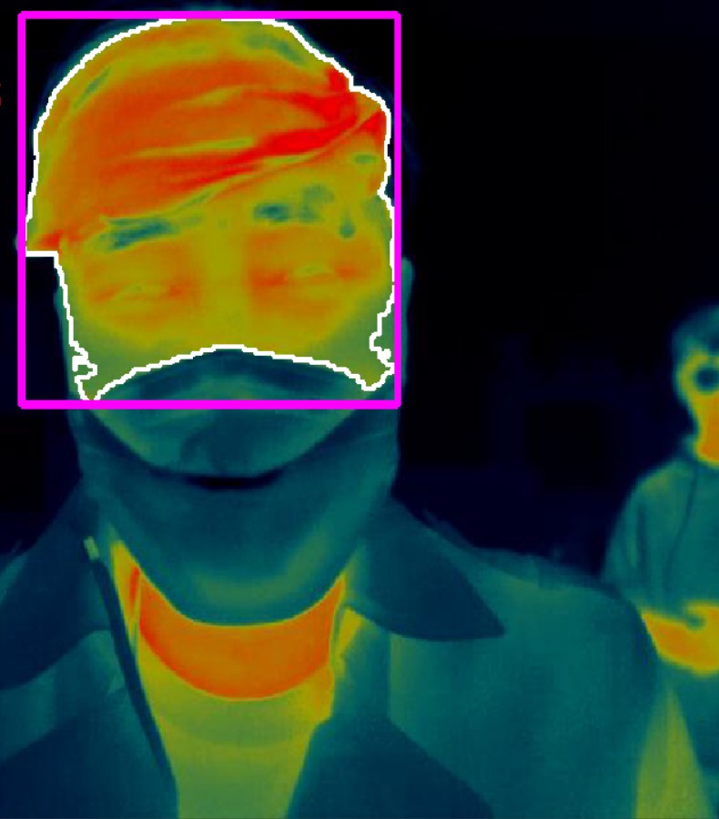

# LAB: Facial Temperature Measurement with IR images

Name:  					ChangMin An

Student Number:   21700421

Program: 				C/C++

IDE/Compiler: 		Visual Studio 2019

OS: 						   Win10


## I. Introduction

**Goal: Detect Face Temperature from IR(Infra-Red) images**

In this lab, we are required to create a simple program that detects the temperature of a person wearing a mask. We will be given a video of IR images of several people measuring their face temperature. Measure the maximum and average temperature of the face (excluding the mask) and show a warning sign if the average temperature is above 38.0 C.

We will not use any deep learning or any other complex algorithms. Just use simple image processing methods such as : InRange, Morphology, Filtering, findContour

**Figure #1. Example of Facial Recognition and Temperature Measurement with IR camera**


As shown in the figure above, the temperature range is mapped through the color shown in IR Camera. As mask from using masks we usually rule out the scope is important. It is also important to consider selecting an appropriate ROI range because each person has a different height and face size.


## II. Procedure

### Part 1. Face Segmentation excluding mask

**Goal: Segmentation using InRange()**

* Analyze the color space of the raw image. We use HSV space.
* Apply necessary pre-processing, such as filtering
* By using InRange(), segment the area of ROI: exposed skin (face and neck) that are not covered by cloth and mask. We use inRange() of all 3-channels of the color image.
* Apply post-processing such as morphology to enhance the object segmentation.
* Use findContours() to detect all the connected objects.
* Select only the proper contour around the face.
* Then, draw the final contour and a box using drawContours(), boundingRect(), rectangle().
* Show example results of each process.


### Part 2. Temperature Measurement

**Goal: Temperature from Intensity data**

The intensity value of the image is the temperature data scaled within the pre-defined temperature range. Use the intensity value to estimate the temperature.

**Figure #2. Example of Temperature from Intensity Data**


* Analyze the intensity values(gray-scale, 0-255) of the given image.
* The actual temperature for this lab is ranged from 25 (I = 0) to 40 C (I = 255).
* Estimate the maximum temperature and average temperature within ONLY the segmented area (Contour Area)
* For average temperature, we use the data within the Top 5% of the temperature in Descending order.
* Show the result as TEXT on the final output image.


## III. Flow Chart


## IV. Experiment

### 1. Histogram HSV Image

In this experiment, raw image is converted into HSV image. At this time in Part 2 histogram to determine to go through analysis and V-image to gray scale. When converting the entire HSV image to gray scale, intensity does not come out continuously. The reason why we want to convert to gray scale is to map a given temperature according to intensity. To this end, it is necessary to find a continuously distributed gray scale.

**Figure #3. Histogram of Raw Figure**

|                        Gray                        |
| :------------------------------------------------: |
|  |

|                        H                        |                        S                        |                        V                        |
| :---------------------------------------------: | :---------------------------------------------: | :---------------------------------------------: |
|  |  |  |

When the raw image is converted to a gray scale(BGR2GRAY), it can be seen that the distribution is biased as follows. To solve this problem, the histogram of each image is analyzed by splitting the HSV image. Looking at the histogram above, it can be seen that the histogram of V is evenly distributed. Since the range of intensity we use is wide, it is right to create a continuous gray scale image using V among H, S, and V.

**Figure #4. Gray Scale Image**


### 2. InRange Setting

The minimum and maximum values of H, S, and V are selected using the InRange() function. At this time, we select and appropriate value by specifying the range of colors we want to measure. We need to match the contour range to the skin, so we set the range by finding the color that matches the skin temperature measured by the IR camera.

**Figure #5. InRange Figure**


------

At this time, the ROI is set so that the range of all people could be selected by analyzing the H, S, and V of each person. Hmin: 0, Hmax: 55, Smin: 60, Smax: 255, Vmin: 100, Vmax: 255 


### 3. Configuration Contours

Previously, the ranges of H, S, and V are determined using InRange(). Contour should be created using the range of these values. At this time, we measure only the skin of the user in the figure, so we build an algorithm to measure only the skin of the user by setting the range of the Contour Area. At this time, the flag is true so that drawing the contour can be output only when the area exceeds a certain range.

In addition, boundingRect(), rectangle() functions are used to express which part of the user is being measured using a rectangular range. Through this, we can get the effect of informing the user that we recognize not only the Contour area we measure but also the entire face.

**Figure #6 Contour Image**

|                  Contour Area                   |                  Contour Rect                   |                   Result Source                   |
| :---------------------------------------------: | :---------------------------------------------: | :-----------------------------------------------: |
|  |  |  |


### 4. ROI Data

The value is stored using the intensity given to IR camera data by converting it into a gray scale in the ROI area we have determined. At this time, masking data is used only the given ROI value. The following figure shows the masked ROI value, and the value is stored using the previously converted gray-scale AND-Method.

**Figure #7. ROI Data to use mask**

|                   Masking                   |                  Contour Rect                  |                Result Source                 |
| :-----------------------------------------: | :--------------------------------------------: | :------------------------------------------: |
|  |  |  |


### 5. Temperature Measurement

Save the values in the ROI and sort them in descending order. In this case, a value of 0 is excluded. The maximum temperature and average temperature are calculated by converting the temperature in celsius using the intensity of the image. In this case, the conversion equation is as follows. This converted value is rounded to form an integer.
$$
Temperature[C] = 15.0 \times pixel / 255 + 25.0
$$
When sorting, all values are sorted in the form of a 1D-array, and the average and max values are obtained by dividing the entire repetition statement by 400 by the size of the array-cols to use only the top 5%. This temperature is printed on the raw video source. At this time, when the average temperature exceeded 38 C, a warning message is also output.

**Figure #8. Result Image**


## V. Analysis

#### 1. Filter

When selecting an image of Gray Scale, the use of a Median Filter is considered to make intensity continuous. On average, Median Filter allows us to extract more continuous images than before using it, but it is not selected because of the large amount of computation, which slows down the speed, and the effect on it is insignificant. The kernel size is 5 in median filter.

**Figure #9. Median Filter Analysis**

|                      Raw Image                       |                     Filtered Image                      |
| :--------------------------------------------------: | :-----------------------------------------------------: |
|  |  |

**Figure #10. Histogram Median Filter Analysis**

|                    Raw Image                    |                     Filtered Image                     |
| :---------------------------------------------: | :----------------------------------------------------: |
|  |  |


#### 2. Masking

In order to set the actual ROI (Region of Interest), a masking matrix is required. At this time, masking is performed in the form of filling the inside by being filtered when calculating the contour area. After that, if we combine the actual data with AND Logic, we can extract only the data.


## VI. Result Video

[Click Demo Video](https://youtu.be/z4PvGD1c74o)


## VII. Conclusion

After the pretreatment, the ROI is extracted through the contour, and the user's temperature is measured accordingly. In the case of such image processing, there is an advantage that it is less burdensome than deep learning in implementing the system. It is important to obtain as clear information as possible in receiving data. To this end, it is necessary to consider pretreatment such as filter and post-treatment such as morphology. The ROI is selected through masking, and the result is output to determine temperature of each user.


## VIII. Appendix

### main.cpp

```c++
/*
* *****************************************************************************
* @author	ChangMin An
* @Mod		2022 - 04 - 07
* @brief	LAB: Facial Temperature Measurement with IR images
******************************************************************************
*/

#include <iostream>
#include <opencv2/opencv.hpp>

using namespace cv;
using namespace std;

// Function Declaration
void Video_Setting(void);
void Read_Video(void);
void Pre_Processing(void);
void Processing(void);
int	 Pixel2Cel(float _pixel);
void Print_Result(void);
void Flag_Update(void);
void View_Result(void);

//=============== Global Variable =================
// Matrix
Mat src, dst, image_disp, image_gray, hsv, mask, roi_gray, dst_1Dsort;
vector<Mat> hsv_split;
vector<vector<Point>> contours;
VideoCapture cap("IR_DEMO_cut.avi");

// Flag
bool warning_Flag = false;
bool text_Flag = false;
bool contourDraw_Flag = false;
bool breaking_Flag = false;

// hsv
#define HMIN 0
#define HMAX 55
#define SMIN 60
#define SMAX 255
#define VMIN 100
#define VMAX 255

// Video Source
int cam_W = 640;
int cam_H = 480;

// Contour Area Range
#define CONTOUR_AREA 13000

// Counting about sorting data to Temperature
float sum_Gray = 0.0;
float avg_Gray = 0.0;
float max_Gray = 0.0;
int avg_Cel = 0;
int max_Cel = 0;
int counting = 0;

int main()
{
	Video_Setting();			// Setting Video Source

	while (true)
	{
		Read_Video();			// Read Video Captured Image
		if (breaking_Flag == true)			break;

		Pre_Processing();		// InRange Processing & Filtering
// Get ROI to use Contour, Calculate Temperature mapping intensity into temperature
        Processing();			
		Print_Result();			// Print the Result about Temperature
		View_Result();			// View Video Output
		Flag_Update();			// Warning and Text Flag Update to false

		char c = (char)waitKey(10);
		if (c == 27)						break;
	}
	return 0;
}

// Pixel to Celsius Temperature Mapping
int Pixel2Cel(float _pixel)
{
	return(int)round(15.0 / 255.0 * _pixel + 25.0);
}

// Setting Video Source
void Video_Setting(void)
{
	cap.set(CAP_PROP_FRAME_WIDTH, cam_W);
	cap.set(CAP_PROP_FRAME_HEIGHT, cam_H);

	if (!cap.isOpened())
	{
		cout << "Cannot open the video cam\n";
		breaking_Flag == true;
	}
}

// Read Video Captured Image
void Read_Video(void)
{
	bool bSuccess = cap.read(src);
	if (!bSuccess)
	{
		cout << "Cannot find a frame from video stream\n";
		breaking_Flag = true;
	}
}

// InRange Processing & Filtering
void Pre_Processing(void)
{
	// Copy Source Image to image_disp and BGR2HSV
	src.copyTo(image_disp);
	cvtColor(src, hsv, COLOR_BGR2HSV);

	// Split matrix to make gray scale temperature
	split(hsv, hsv_split);
	hsv_split[2].copyTo(image_gray);

	// set dst as the output of InRange
	inRange(hsv, Scalar(MIN(HMIN, HMAX), MIN(SMIN, SMAX), MIN(VMIN, VMAX)),
		Scalar(MAX(HMIN, HMAX), MAX(SMIN, SMAX), MAX(VMIN, VMAX)), dst);
}

// Get ROI to use Contour, Calculate Temperature mapping intensity into temperature
void Processing(void)
{
	// Find All Contour
	findContours(dst, contours, CV_RETR_EXTERNAL, CV_CHAIN_APPROX_SIMPLE);

	if (contours.size() > 0)
	{
		double maxArea = 0;
		int maxArea_idx = 0;

		for (int i = 0; i < contours.size(); i++)
		{
			// Set Contour Minimum Area
			if (contourArea(contours[i]) > CONTOUR_AREA)	contourDraw_Flag = true;
			else											contourDraw_Flag = false;

			// Set Contour Maximum Area
			if (contourArea(contours[i]) > maxArea)
			{
				maxArea = contourArea(contours[i]);
				maxArea_idx = i;
			}
		}

		// Draw Rectangular Area
		Rect boxPoint = boundingRect(contours[maxArea_idx]);
		Mat dst_out = Mat::zeros(dst.size(), CV_8UC3);
		mask = Mat::zeros(dst.size(), CV_8UC1);
		roi_gray = Mat::zeros(dst.size(), CV_8UC1);

		// Continue Drawing the Contour Box
		if (contourDraw_Flag)
		{
			// Recognition about Temperature Text Printing
			text_Flag = true;
			drawContours(dst_out, contours, maxArea_idx, Scalar(255, 255, 255), 2, 8);

			// Masking about Contours Area
			drawContours(mask, contours, maxArea_idx, Scalar(255, 255, 255),
                         CV_FILLED, 8);

			image_disp += dst_out;

			// Draw the Contour Box on Original Image
			rectangle(image_disp, boxPoint, Scalar(255, 0, 255), 3);

		}
		
		// Draw ONLY ROI Area to use Masking matrix
		bitwise_and(image_gray, image_gray, roi_gray, mask);

		// Sorting roi gray-scale image to descending 1D array
		dst_1Dsort = roi_gray.reshape(0, 1);
		cv::sort(dst_1Dsort, dst_1Dsort, SORT_DESCENDING);
	}

	// Calculate Temperature to use ROI Area value
	counting = 0;
	sum_Gray = 0.0;
	max_Gray = 0.0;

	for (int i = 0; i < (dst_1Dsort.cols)/400; i++)
	{
		if (dst_1Dsort.at<uchar>(0, i) != 0)
		{
			if (max_Gray <= dst_1Dsort.at<uchar>(0, i))	
				max_Gray = dst_1Dsort.at<uchar>(0, i);
			sum_Gray += dst_1Dsort.at<uchar>(0, i);
			counting++;
		}
	}

	if (counting != 0)		
		avg_Gray = (float)(sum_Gray / (float)counting);

	// Fitting from gray-scale to Celsius
	avg_Cel = Pixel2Cel(avg_Gray);
	max_Cel = Pixel2Cel(max_Gray);

	// Warning about User Temperature up to 38
	if (avg_Cel >= 38)	warning_Flag = true;
}

// Print the Result about Temperature
void Print_Result(void)
{
	String max_String = "Max: ";
	String max_Value = to_string(max_Cel);
	String avg_String = "AVG: ";
	String avg_Value = to_string(avg_Cel);
	String warning = "WARNING";
	String max = max_String + max_Value;
	String avg = avg_String + avg_Value;

	if (text_Flag)
	{
		if (warning_Flag)
		{
			putText(image_disp, max, Point(20, 20), FONT_HERSHEY_SIMPLEX, 0.5, 								Scalar(0, 0, 255), 1);
			putText(image_disp, avg, Point(20, 40), FONT_HERSHEY_SIMPLEX, 0.5,
                    Scalar(0, 0, 255), 1);
			putText(image_disp, warning, Point(20, 70), FONT_HERSHEY_SIMPLEX, 1.0,  						Scalar(0, 0, 255), 3);
		}
		else
		{
			putText(image_disp, max, Point(20, 20), FONT_HERSHEY_SIMPLEX, 0.5, 		    					Scalar(255, 255, 255), 1);
			putText(image_disp, avg, Point(20, 40), FONT_HERSHEY_SIMPLEX, 0.5,  							Scalar(255, 255, 255), 1);
		}
	}
}

// View Video Output
void View_Result(void)
{
	namedWindow("Display", 0);
	imshow("Display", image_disp);
}

// Warning and Text Flag Update to false
void Flag_Update(void)
{
	text_Flag = false;
	warning_Flag = false;
}
```
