# LAB: Straight Lane Detection and Departure Warning

Name:  					ChangMin An

Student Number:   21700421

Program: 				Python 3.7, Open-CV 4.5.4

IDE/Compiler: 		Visual Studio Code

OS: 						   Win10


## I. Introduction

**Goal: Detect Straight Lane and Departure Warning**

In this lab, we perform to create a program that displays lane departure warning message from the road lane detection.

To simplify this lab, only the straight lanes are to be detected and other difficult driving environment such as curved lanes and road intersections are ignored. We build up algorithm using canny(), HoughLinesP(), and filter. The evaluation of the project will be based on the success detection rate of the lanes of the test and validation video clips.

After pre-processing such as filter, Canny and Hough transform, which are techniques to find lines. It is important to select an appropriate threshold to recognize the line. It also proceeds to compare the position of the vehicle to the center of the lane and warn them if it exceeds a certain range of bias. 

**Figure #1. Example of Straight Lane Detection and Departure Warning**

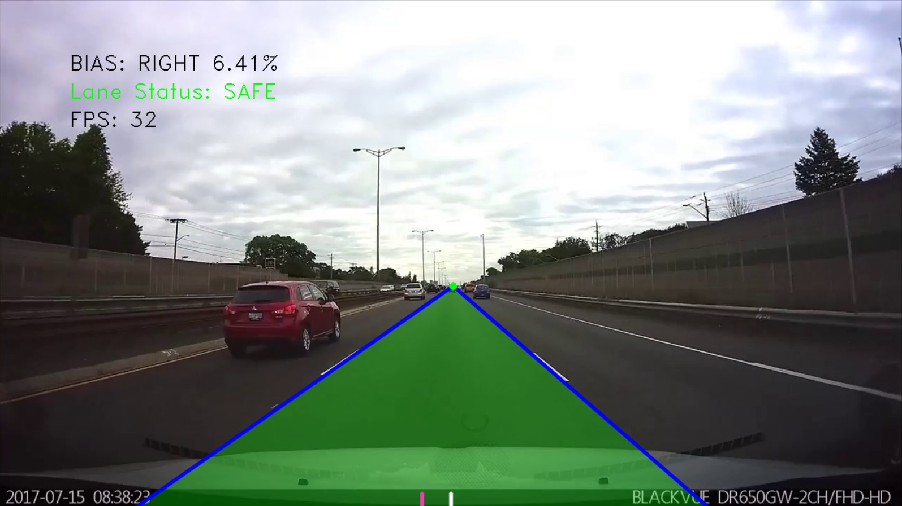


As shown in the figure above, the bias is measured by analyzing the center and lane of the vehicle, and if the bias exceeds 20%, the lane departure warning is issued. In addition, the image processing speed is confirmed by analyzing the FPS of the image. Finally, it is possible to check how much lane recognition is being performed by dividing whether or not lane recognition is performed by color(Blue, Yellow).


## II. Procedure

### Part 1. Straight Lane Detection

* Remove the noise from the image using a Gaussian Blur Filter.
* Using the Canny technique, the line of the image and the land are distinguished.
* Create an ROI(Region of Interest) to recognize only the lanes that belong to the vehicle among the lanes that are captured by the camera.
* Use the Hough transform technique to determine the coordinates of the lane.
* Calculate the equation of the straight line using the coordinates from the Hough transform. At this time, the left and right lanes are separated using the slope of the straight line equation.
* In the equation of the straight line on the left and right, the maximum slope is selected, and the ymax value of image and the departure point is used as coordinates.


### Part 2. Departure Warning and Lane Changing

* If the lane is not recognized, the count is counted, and if it exceeds a certain value, an algorithm is constructed so that the lane is not recognized.
* Calculate the bias between the mid-point and the center of the vehicle in both directions and warn them to maintain the lane if it exceeds 20%
* Construct an algorithm that recognizes that the vehicle changes lanes if it exceeds a specific count.
* The FPS, current state, and bias are calculated and expressed in the image.


## III. Flow Chart

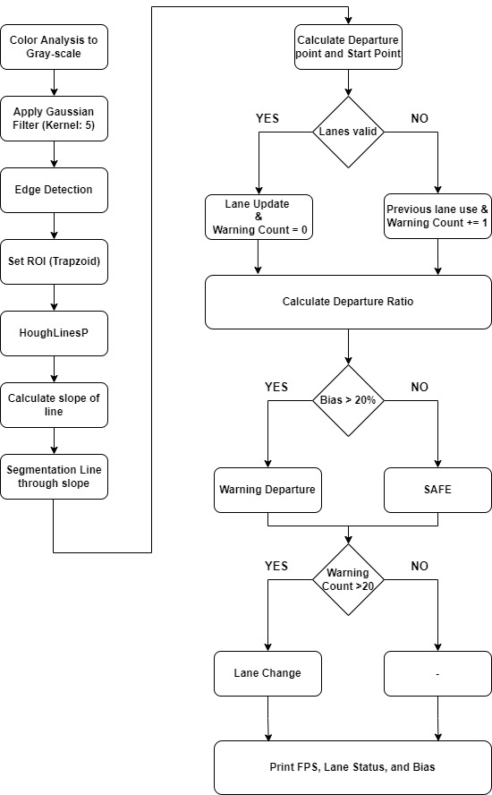


## IV. Experiment

### 1. Pre-Processing

In this experiment, noise is removed using Gaussian Filter(Kernel Size = 5X5) in the lane keeping image. It is judged that the difference in accuracy before and after the filter treatment is insignificant, so it is used only as a Gaussian Filter, not a Median filter. Since filter is used when using Canny, it is judged that using it as it is rather than removing additional noise can speed up the image processing.

**Figure #2. Raw Image and Gaussian Filtered Image**

|                   Raw Image                   |              Gaussian Filtered Image               |
| :-------------------------------------------: | :------------------------------------------------: |
| 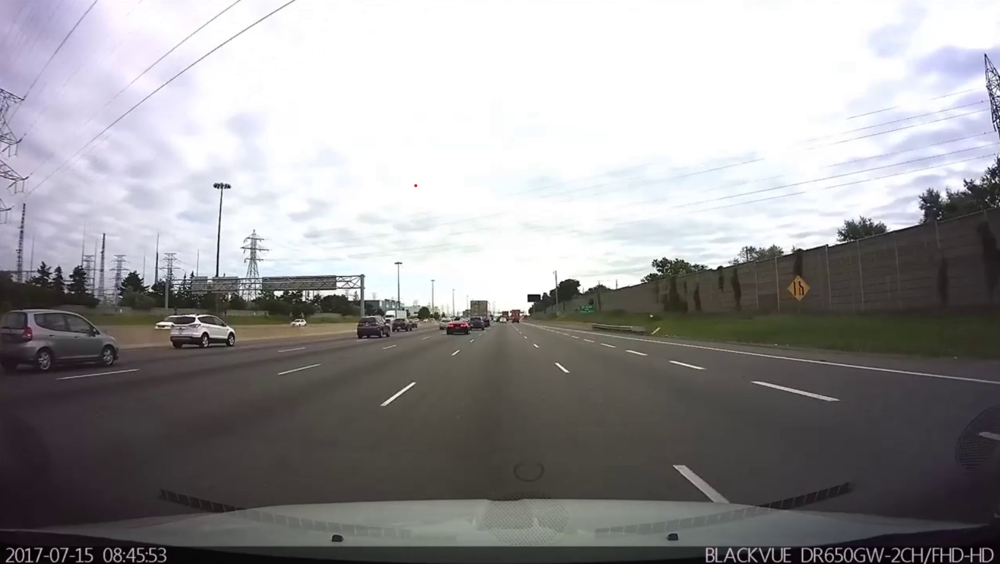 | 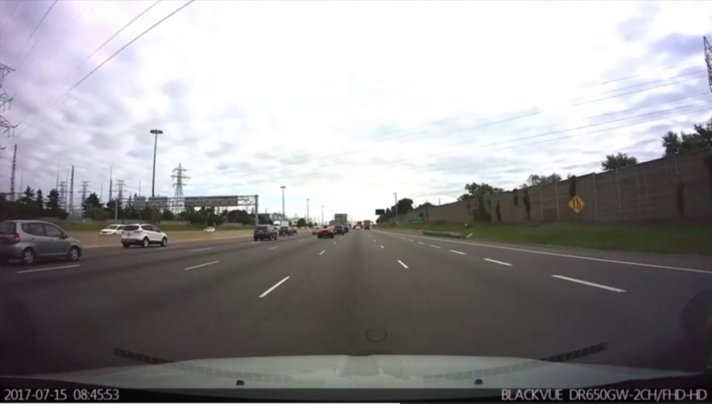 |


### 2. Canny Edge Detection

After pre-processing, use Canny to detect the line. At this time, threshold values are 50 and 250. Use Canny Edge to select an appropriate threshold so that the line we want is detected as much as possible. All edges of the image is found through canny edge detection


**Figure #3. Canny Edge Detection Figure**


------


### 3. Region of Interests(ROI)

After finding all edges of the image through canny edge detection, the ROI technique is used to handle only the lane in which the vehicle is located. At this time, when masking, it is made into a trapezoidal shape using the fillConvexPoly() function. After that, only the lane in which the vehicle is located is output using the bitwise_and() operator. When the region of interests(ROI) technique is used, only necessary parts are output, which is also advantage in reducing the amount of computation.

**Figure #4 ROI Data to use mask**

|                   Canny Edge                    |                     Masking                     |                 Result Source                  |
| :---------------------------------------------: | :---------------------------------------------: | :--------------------------------------------: |
| 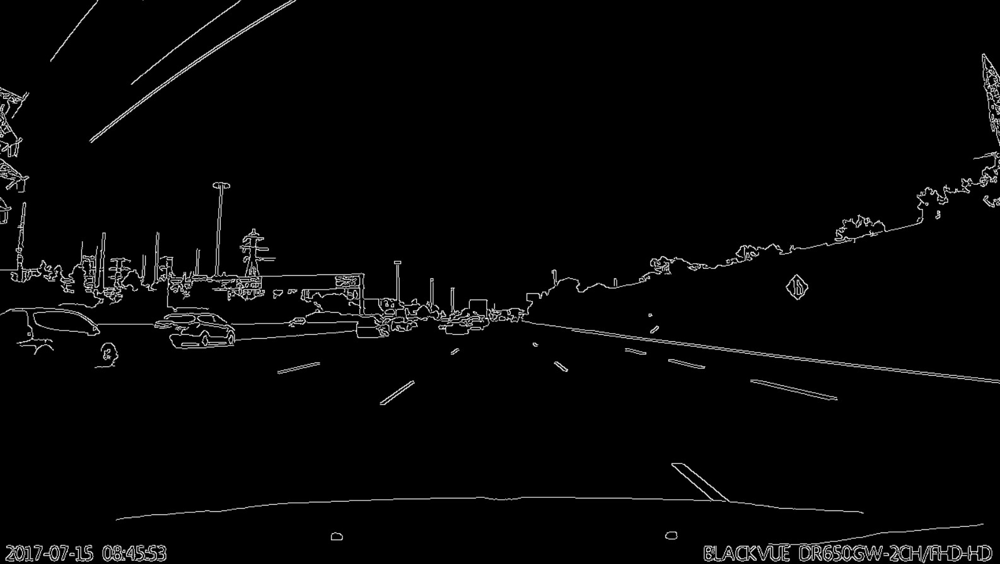 | 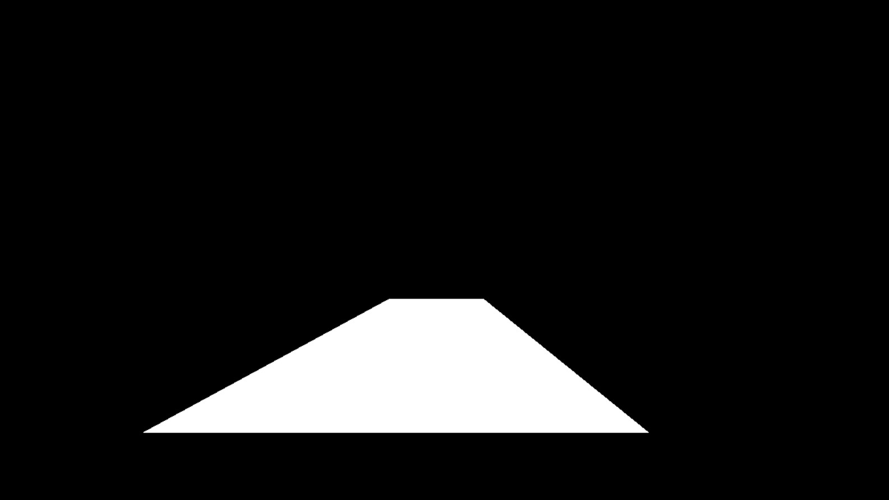 | 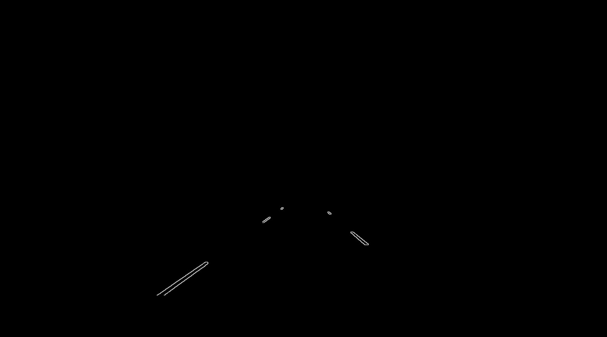 |


### 4. Hough Transform

After detecting only the area desired by the user through ROI, a straight line is detected using Hough Transform. When comparing the Hough Lines technique and the Hough Lines Probability technique, the output value using the Hough Lines Probability technique is detected only in the lane we wanted, so the Hough Lines probability technique is selected. The output at this time results in a range of straight line coordinates. The reason is that the lane has an area and a line with various slopes is drawn in selecting a specific point among the lanes. In addition, since various straight lines are detected in one lane, it is necessary to classify them. At this time, the threshold value used for the Hough Transform is selected at 50, the minLineLength is selected as 10, and the maxLineGap is selected as 1000.

**Figure #5. Hough Transform Figure**

|                     Input                      |                   HoughLines                   |                   HoughLinesP                   |
| :--------------------------------------------: | :--------------------------------------------: | :---------------------------------------------: |
|  | 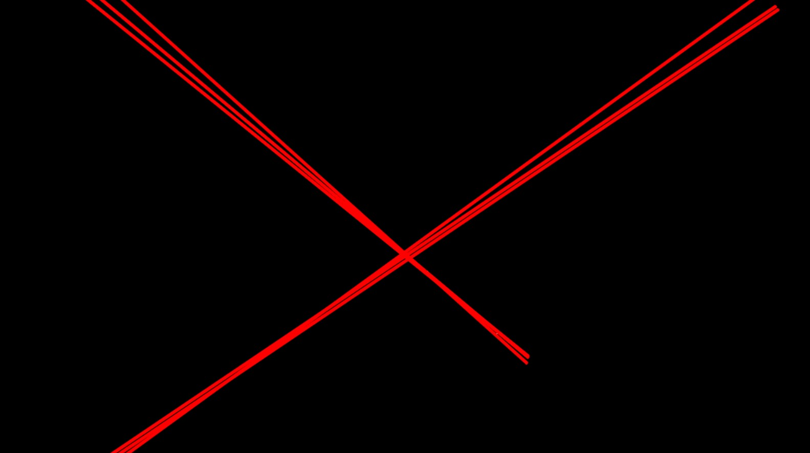 | 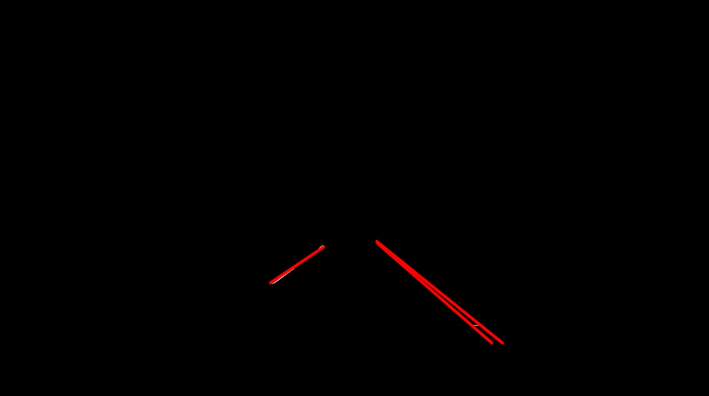 |


### 5. Segmentation Line

The output image using Hough Transform has a straight line with several slopes. However, we need a segmentation process to detect only one straight line per lane. When segmenting, calculate the slope using the detected coordinates. Then, the left lane and the right lane are separated according to the sign of the slope value. In the case of the left, the slope is set and classified from -85 to -30 degrees, and in the case of the right, the slope is set from 30 to 85 degrees. After that, an algorithm is constructed to recognize that the absolute value of each slope is the largest as the lane of each actual position. This is because, when each lane recognizes, a straight line of various slopes is detected due to the area of each lane, where the user wants the largest slope value of each position.

When each coordinate is obtained in this way, the slope and the y-intercept are obtained using two points for each straight line, and the start point and the end point are selected. In this case, the y value of the start point is set to be the y_max value of the image, and the end point is set to the departure point. In this case of departure point, set it to be intersection of the equation of the two straight lines. 

**Figure #6. Segmentation Image**


### 6. Lane Recognition Algorithm

When the lane is not recognized, the previous value is stored and output. At this time, in order to know how much lane recognition is being performed, the count increases every time it is not recognized. To distinguish whether the lane is recognized or not, the color line is drawn differently. The lane is drawn in blue when it is recognized, and yellow when it is not recognized.

**Figure #7. Lane Recognition Image**

|                         Success                          |                         Fail                          |
| :------------------------------------------------------: | :---------------------------------------------------: |
| 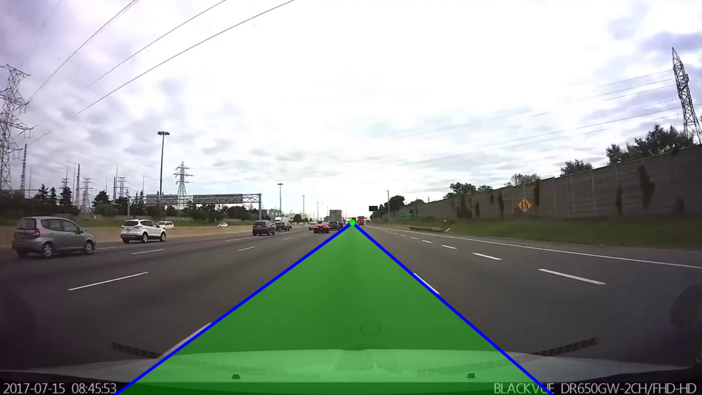 | 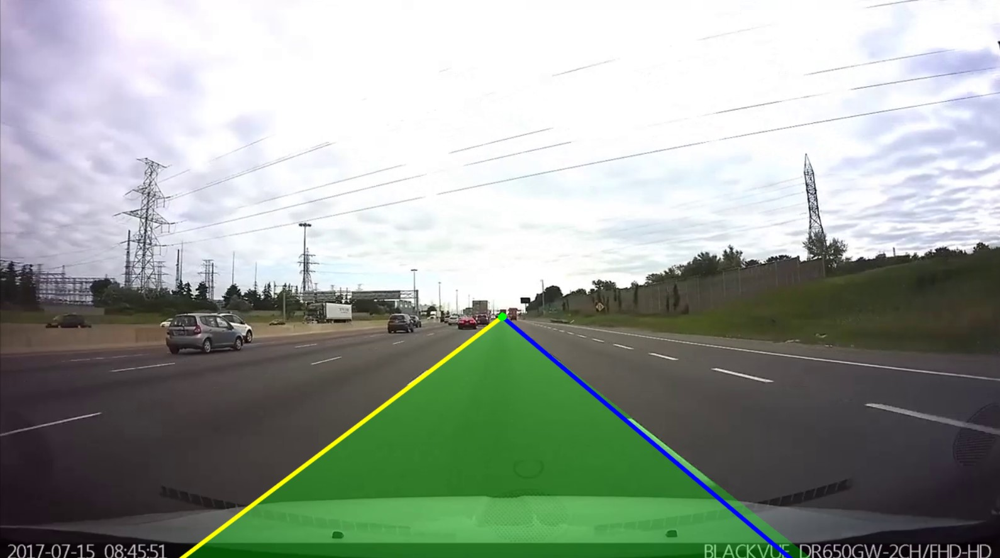 |


### 7. Bias between Vehicle and Lane

First, to calculate the center of the vehicle, we calculate half of the Xmax of the image. After that, the center of the start point of left and right is calculated and the ratio is calculated.

**Bias = (Vehicle_Point - Mid_Point) / Mid_Point * 100 [%]**

If the bias exceeds 20%, the vehicle is ordered to remain in the lane. If not, give SAFE commands. In addition, it calculates whether the vehicle is located on the left or the right according to the sign of bias and outputs it to the image.

**Figure #8. BIAS & Lane Status Figure**

|                     SAFE                      |                     WARNING                      |
| :-------------------------------------------: | :----------------------------------------------: |
| 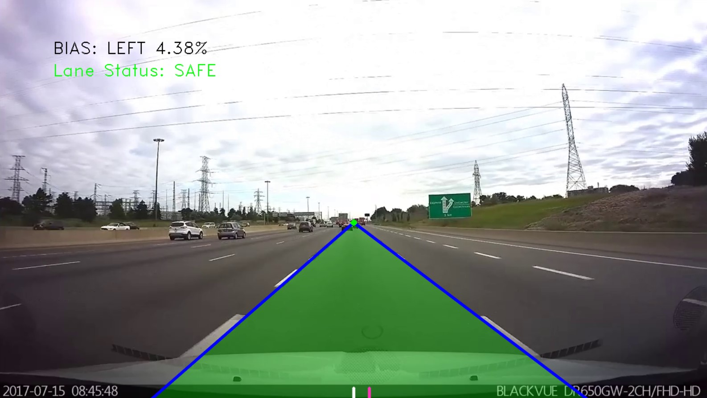 | 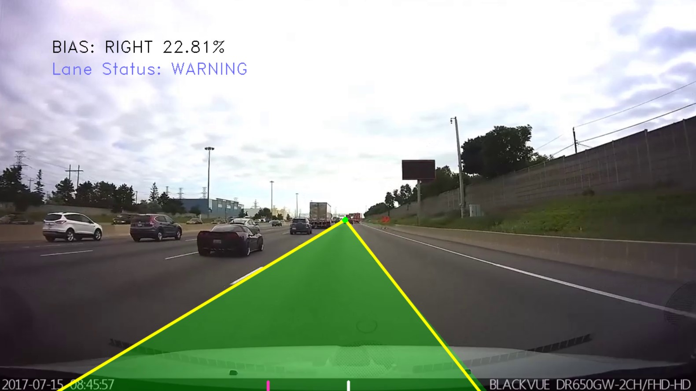 |


### 8. Lane Change

The degree of which the left and right lines are recognized is determined, and when the count exceeds 20, the lane change mode is set. If the left lane is not recognized, it means that the vehicle is moving to the right, and if the right lane is not recognized, it means that the vehicle is moving to the left. If the vehicle is moving in the lane, bias does not output, and line outputs only the recognized line. At this time, the color of all lines is changed to red and printed. And the direction of vehicle movement is displayed on the screen.

**Figure #9. Lane Change Figure**

|                         LEFT                         |                         RIGHT                         |
| :--------------------------------------------------: | :---------------------------------------------------: |
| 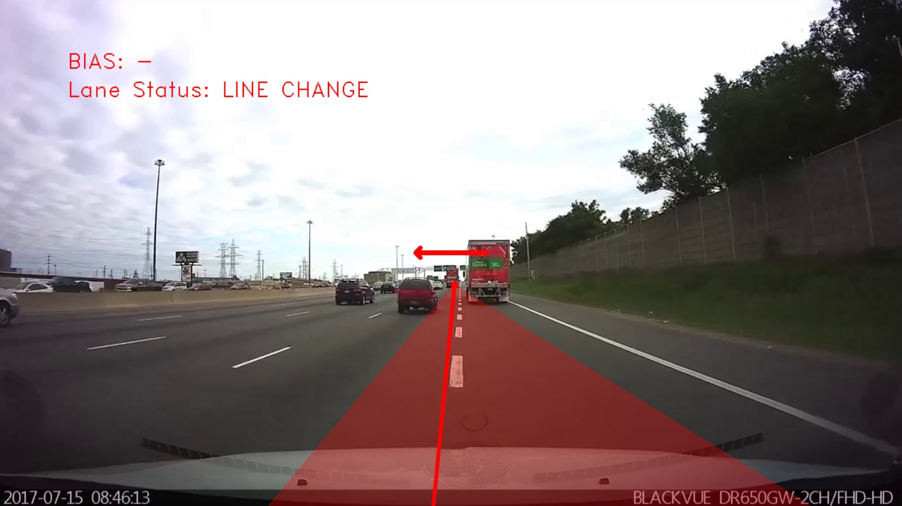 | 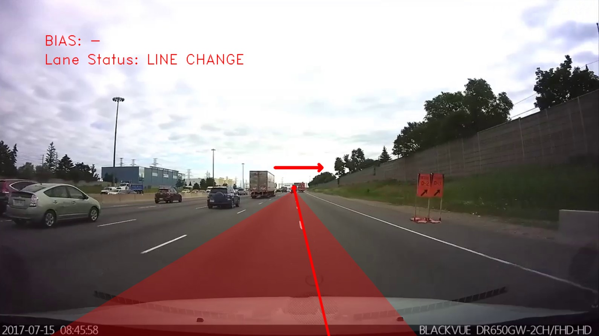 |


### 9. FPS & Final Process

All images are performed through the while() statement. At this time, the FPS is obtained by calculating the count of the start and end points of the while statement. By outputting this, this image processing speed can be known, and it can be analyzed in term of efficiency. FPS can be obtained through the following equation.

**FPS = getTickFrequency() / (endTime - startTime)**

**Figure #10. Final Image**


## V. Analysis

#### 1. Segmentation Line

Various techniques is used when segmenting the line. First, the slope of each line is divided into the left direction and the right direction, and then the average of the slopes is calculated to implement an algorithm to form a line. However, if the average of all lines is calculated, the lane recognition becomes unstable because lines of different lanes are calculated together. The second method is to obtain the max value of the absolute value of each slope, which is the method adopted this time, and to obtain the coordinates related.

There are various techniques for segmenting lanes, and each method has its own strengths and weaknesses. Therefore, it is judged that if the algorithm is built according to each situation, a more stable segmentation can be formed.


#### 2. Lane Change

When the vehicle changes the lane, an algorithm is required to stop all other flags. When recognizing a lane, the left and right sides are distinguished according to the slope, and one lane recognized when changing lanes changes direction, resulting in the problem of two lanes recognizing at the point of change. Therefore, when changing lanes, it is necessary to construct an algorithm so that lane recognition is not performed.


## VI. Result Video

[Click Demo Video](https://youtu.be/nfw_IXNnsvU)


## VII. Conclusion

In this experiment, an algorithm for detecting only the lane of an image and outputting one lane is performed. In the process, the Canny Edge Detection technique and the Hough Lines Probability technique are used. When segmenting several lines into one line, it is carried out using the absolute value of the slope, and a suitable line could be detected through this. By checking bias, FPS, and Lane Status, it is possible to analyze the current state of the vehicle. Finally, an algorithm is established in the area where the lane is not recognized when the vehicle is changed, and an algorithm is also established to indicate in which direction the vehicle changes lanes. In conclusion, it can be seen that the image processing enables the creation of a vehicle's lane keeping system, and by analyzing the FPS, it is possible to analyze how efficient this algorithm is.


## VIII. Appendix

### Lane_Detection.py

```python
'''
* *****************************************************************************
* @author	ChangMin An
* @Mod		2022 - 05 - 01
* @brief	DLIP LAB: Straight Lane Detection and Departure Warning
* *****************************************************************************
'''

#===============================================#
#              Open Library Declare             #
#===============================================#
import math
import numpy as np
import cv2 as cv
from matplotlib import pyplot as plt
from cv2 import *
from cv2.cv2 import *
import copy

#===============================================#
#                Global Variable                #
#===============================================#
# Video = "road_straight_student.mp4"
Video = "road_lanechange_student.mp4"

# Color Definition (BGR)
WHITE               = (255, 255, 255)
RED                 = (  0,   0, 255)
GREEN               = (  0, 255,   0)
PINK                = (184,  53, 255)
YELLOW              = (  0, 255, 255)
BLUE                = (255,   0,   0)
BLACK               = (  0,   0,   0)
PURPLE              = (255, 102, 102)

# Line Definition
DEG2RAD             = np.pi/180
RAD2DEG             = 180/np.pi
ANGLE_LEFT          = -30
ANGLE_RIGHT         = 30
LINE_WIDTH          = 4
CIRCLE_RADIUS       = 5
BIAS_LENGTH         = 20
TRANSPARENCY        = 0.3

WARNING_COUNT       = 20
SLOPE_OFFSET        = 0.0001
LANE_WARNING        = 20

# Font Definition
USER_FONT           = FONT_HERSHEY_DUPLEX

# Length Definition
ARROW_LENGTH        = 100
RECOGNITION_LENGTH  = 120

# Hough Transform
houghThresh          = 50

# Line Processing
left_min            = 0.0
right_Max           = 0.0
left_Coordinate     = [3, 2, 0, 0]
right_Coordinate    = [3, 2, 0, 0]
vanishing_Point     = []

# Line Detection
left_Count          = 0
right_Count         = 0

# Time Count
startTime           = 0
endTime             = 0

# Font
font_Color          = BLACK
status_Color        = GREEN

#===============================================#
#                     Main                      #
#===============================================#

# Open the Video
cap = cv.VideoCapture(Video)
if (cap.isOpened() == False):
    print("NOT Open the VIDEO")

#================== While Loop =================#                  
while(1):
    # Start Window Time
    startTime = cv.getTickCount()

    # Read Video Capture
    cap_Flag, src = cap.read()
    
    # If Capture is failed, break the loop
    if cap_Flag == False:
        print("Video End")
        break
    
    # Pre-Processing
    src_filtered = GaussianBlur(src, (5,5), 0)
    
    # Canny Edge Detection
    src_canny = Canny(src_filtered, 50, 250, None, 3)
    
    # ROI Setting
    roi = np.zeros_like(src_canny, np.uint8)
    src_roi = np.zeros_like(src_canny, np.uint8)
    roi_point = np.array([[560,430], [695, 430], [1100, 620], [210, 620]])
    roi = fillConvexPoly(roi, roi_point, WHITE)
    bitwise_and(src_canny, src_canny, src_roi, roi)
    
    # Hough Transform (HoughLinesP)
    linesP = HoughLinesP(src_roi, 1, DEG2RAD, houghThresh, 1, 10, 1000)  

    #================== Line Processing =================#

    # Initialization Variable
    slope, left_min, right_Max = 0.0, 0.0, 0.0
    left_Coordinate_Temp = copy.deepcopy(left_Coordinate)
    right_Coordinate_Temp = copy.deepcopy(right_Coordinate)
    vanishing_Point_Temp = copy.deepcopy(vanishing_Point)

    # Initialization
    left_Flag = False
    right_Flag = False
    circle_Color, area_Color, text_Color = GREEN, GREEN, BLACK        # Color Definition

    if linesP is not None:
        for i in range(len(linesP)):
            l = linesP[i][0]
            x1, y1, x2, y2 = l[0], l[1], l[2], l[3]

            # Slope
            slope = float((y2 - y1) / ((x2 - x1) + SLOPE_OFFSET))
            
            # Condition of Slope range(LEFT)
            if slope > np.tan(-85 * DEG2RAD) and slope < np.tan(ANGLE_LEFT * DEG2RAD):
                left_Flag = True
                if slope < left_min:
                    left_min = slope
                    left_Coordinate = [x1, y1, x2, y2]
            
            # Condition of Slope range(RIGHT)
            elif slope < np.tan(85 * DEG2RAD) and slope > np.tan(ANGLE_RIGHT * DEG2RAD):
                right_Flag = True
                if slope > right_Max:
                    right_Max = slope
                    right_Coordinate = [x1, y1, x2, y2]
       
    # Equation of the Straight Line(LEFT)
    if left_Flag == True:
        m1 = float((left_Coordinate[1] - left_Coordinate[3]) / (left_Coordinate[0] - left_Coordinate[2]))
        b1 = float(left_Coordinate[1] - m1 * left_Coordinate[0])
        left_Color = BLUE            # Color Recognization
        left_Count = 0               # Initialization Recognize Counting

    elif left_Flag == False:
        m1 = float((left_Coordinate_Temp[1] - left_Coordinate_Temp[3]) / (left_Coordinate_Temp[0] - left_Coordinate_Temp[2]))
        b1 = float(left_Coordinate_Temp[1] - m1 * left_Coordinate_Temp[0])
        left_Color = YELLOW          # Color Recognization
        left_Count += 1              # Recognize Counting


    # Equation of the Straight Line(RIGHT)
    if right_Flag == True:
        m2 = float((right_Coordinate[1] - right_Coordinate[3]) / (right_Coordinate[0] - right_Coordinate[2]))
        b2 = float(right_Coordinate[1] - m2 * right_Coordinate[0])
        right_Color = BLUE           # Color Recognization
        right_Count = 0              # Recognize Counting

    elif right_Flag == False:
        m2 = float((right_Coordinate_Temp[1] - right_Coordinate_Temp[3]) / (right_Coordinate_Temp[0] - right_Coordinate_Temp[2]))
        b2 = float(right_Coordinate_Temp[1] - m2 * right_Coordinate_Temp[0])
        right_Color = YELLOW          # Color Recognization
        right_Count += 1              # Recognize Counting

    # Line Starting Point
    Ymax, Xmax, _ = src.shape
    left_Start = [int((Ymax - b1)/m1), Ymax]
    right_Start = [int((Ymax - b2)/m2), Ymax]
    lane_Length = abs(left_Start[0] - right_Start[0])

    # Vanishing Point
    if left_Count > WARNING_COUNT or right_Count > WARNING_COUNT or lane_Length < RECOGNITION_LENGTH:
        vanishing_Point[0] = vanishing_Point_Temp[0]
        vanishing_Point[1] = vanishing_Point_Temp[1]
        left_Color, right_Color, circle_Color, area_Color = RED, RED, RED, RED

    else:
        vanishing_Point = [int((b2-b1)/(m1-m2)), int((float(b2-b1))*m1/(m1-m2)+float(b1))]

    # Draw the Direction Area
    direction_Array = np.array([vanishing_Point, left_Start, right_Start])    
    mask = src.copy()
    cv.fillConvexPoly(mask, direction_Array, area_Color)
    src = addWeighted(src, 1-TRANSPARENCY, mask, TRANSPARENCY, gamma=0)

    #========================== BIAS =======================#

    # Bias between Mid-Point and Vanish-Point
    mid_Point = [int(Xmax/2), int(Ymax)]
    vehicle_Point = int((left_Start[0] + right_Start[0])/2)
    bias = round((vehicle_Point - mid_Point[0]) / mid_Point[0] * 100.0, 2)    # [%]

    # Draw the Bias Line
    if left_Count <= WARNING_COUNT and right_Count <= WARNING_COUNT and lane_Length > RECOGNITION_LENGTH:
        cv.line(src, (mid_Point[0], mid_Point[1]),(mid_Point[0], mid_Point[1] - BIAS_LENGTH), WHITE, LINE_WIDTH, cv.LINE_AA)
        cv.line(src, (vehicle_Point, mid_Point[1]),(vehicle_Point, mid_Point[1] - BIAS_LENGTH), PINK, LINE_WIDTH, cv.LINE_AA)

    # Draw the line & Vanishing Point
    if left_Count < WARNING_COUNT:
        cv.line(src, (left_Start[0], left_Start[1]),(vanishing_Point[0], vanishing_Point[1]), left_Color, LINE_WIDTH, cv.LINE_AA)
    if right_Count < WARNING_COUNT:
        cv.line(src, (right_Start[0], right_Start[1]),(vanishing_Point[0], vanishing_Point[1]), right_Color, LINE_WIDTH, cv.LINE_AA)
    cv.circle(src, (vanishing_Point[0], vanishing_Point[1]), CIRCLE_RADIUS, circle_Color, -1, FILLED)

    #========================== TEXT =======================#

    # BIAS Text    
    if left_Count > WARNING_COUNT or right_Count > WARNING_COUNT:
        font_Color = RED
        bias_Text = "BIAS: -"
    elif lane_Length > RECOGNITION_LENGTH:
        font_Color = BLACK 
        if bias >= 0.0:
            bias_Direction = "LEFT"
        else:
            bias_Direction = "RIGHT"     
        bias_Text = f"BIAS: {bias_Direction} {abs(bias)}%"
    else:
        font_Color = font_Color
        bias_Direction = bias_Direction
    
    # Print Bias
    putText(src, bias_Text, (100, 100), USER_FONT, 1, font_Color)

    # Lane Status
    if left_Count > WARNING_COUNT or right_Count > WARNING_COUNT: 
        status_Color = RED
        lane_Status = "LINE CHANGE"
    elif abs(bias) > LANE_WARNING:
        status_Color = PURPLE
        lane_Status = "WARNING"
    elif left_Count < WARNING_COUNT and right_Count < WARNING_COUNT and lane_Length > RECOGNITION_LENGTH:
        status_Color = GREEN
        lane_Status = "SAFE"
    else:
        status_Color = status_Color
        lane_Status = lane_Status
    
    lane_Text = f"Lane Status: {lane_Status}"
    
    # Print Lane Status
    putText(src, lane_Text, (100, 140), USER_FONT, 1, status_Color)

    # Press Esc to Exit, Stop Video to 's' 
    k = cv.waitKey(5) & 0xFF
    if k == 27:
        break
    elif k == ord('s'):
        cv.waitKey()
   
    # Time Loop End
    endTime = cv.getTickCount()

    # FPS Calculate
    FPS = round(getTickFrequency()/(endTime - startTime))

    # FPS Text
    FPS_Text = f"FPS: {FPS}"
    putText(src, FPS_Text, (100, 180), USER_FONT, 1, BLACK)

    # Imshow the source
    imshow("source", src)

# Release
cv.destroyAllWindows()
cap.release()
```
