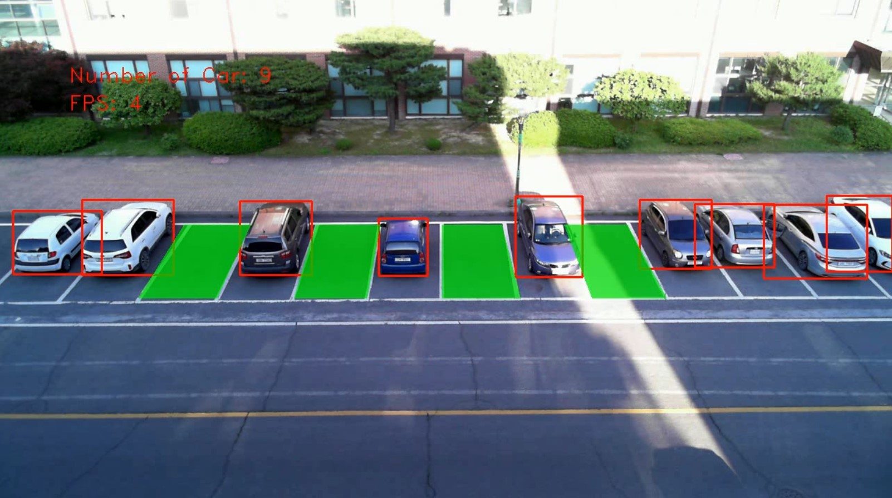
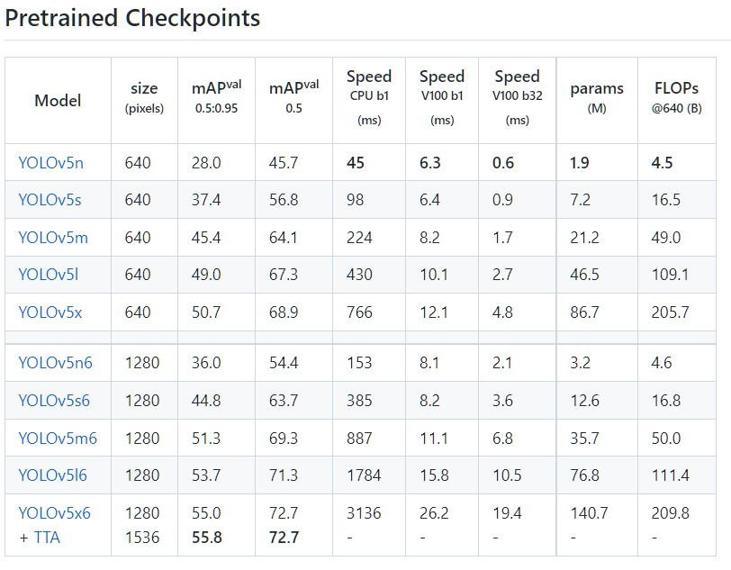
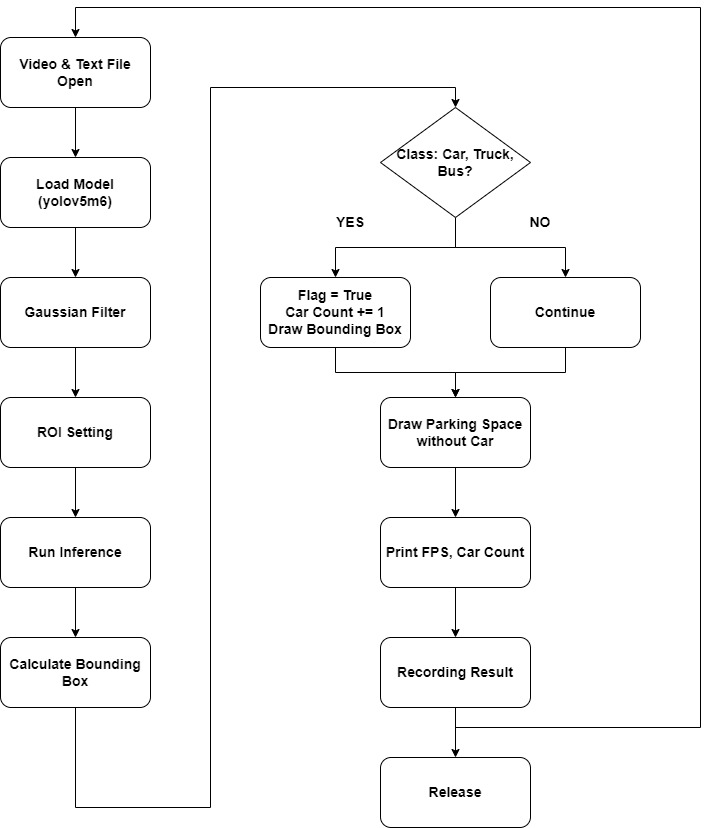

# LAB: Parking Management System

Date: 							2022.05.29

Name:  						ChangMin An

Student Number:   	21700421

Github: 						[Link](https://github.com/ckdals915/DLIP.git)

Demo Video: 		  	[Link](https://youtu.be/UxfRx_APDns)


## I. Introduction

**Goal: Parking Management System using CNN Object Detection Technique**

In this experiment, we aim to display the number of cars parked in the parking lot and parking space available using the *CNN Object Detection* technique. For this purpose, the YOLO V5 algorithm is used, and the pretrained YOLO V5m6 model is used. In addition, pre-processing is performed through ROI techniques to recognize only the presence or absence of vehicle, and classified according to the class. In a given dataset, the maximum parking space is 13. Validation is confirmed by outputting this result and FPS and recording the number of vehicle for each frame.

**Figure #1. Example of Parking Management System**



As shown in the given figure, a bounding box is drawn for each vehicle, and in the case of empty parking, it is marked. After that, the FPS and the number of parked vehicle is output.

**References:**

* [CNN Object Detection](https://ykkim.gitbook.io/dlip/deep-learning-for-perception/lab/lab-cnn-object-detection-1)


## II. Requirement

### Hardware

* NVIDIA GeForce RTX 3060 Laptop GPU

### Software

* CUDA 11.3
* cudatoolkit 11.3.1
* Python 3.9.12
* Pytorch 1.10.2
* TorchVision 0.11.3
* OpenCV 4.5.5
* YOLO v5


## III. Dataset

The model used in this lab is YOLO V5m6. The speed and mAP for this model are as follows.



**Dataset link**: [Link](https://github.com/ultralytics/yolov5/releases)


## III. Flow Chart




## IV. Procedure

### 1. Setup

First, installation is carried out using Anaconda Prompt to build the environment. We should also check the CUDA version of each laptop or computer's graphic card. If the graphic card is **NVIDIA RTX 30 Series**, MUST proceed with **step 2-2**. Other than that, carry out **step 2-1**.

```python
import torch
import cv2 as cv
from matplotlib import pyplot as plt
from cv2 import *
from cv2.cv2 import *
import random
from PIL import Image
import numpy as np
```


### 2. Installation

#### 2-1. Without NVIDIA RTX 30 Series

[Installation Guide](https://ykkim.gitbook.io/dlip/installation-guide/installation-guide-for-deep-learning)


#### 2-2. With NVIDIA RTX 30 Series

[Installation Guide](https://ykkim.gitbook.io/dlip/installation-guide/installation-guide-for-deep-learning)

Proceed to number 4 in the above guidance, and then proceed with the following steps.


**2-2-1. Install GPU Driver**

**NVIDIA GPU driver and Library**: To operate the GPU.

* **Graphic Driver** - Mandatory installation. Download from NVIDIA website
* **CUDA** - GPU library. Stands for *Compute Unified Device Architecture.*
* **cuDNN** - DL primitives library based on CUDA. Stands for *CUDA Deep Neural Network.*

Follow [How to install Driver](https://ykkim.gitbook.io/dlip/installation-guide/cuda-installation) : Continue until **Step 3**


**2-2-2. Install CUDA, cuDNN**

Install the following command by running Anaconda Prompt with administrator privileges.

```python
# CUDA 11.3
conda activate py39
conda install -c anaconda cudatoolkit==11.3.1 cudnn seaborn jupyter
conda install pytorch=1.10 torchvision torchaudio cudatoolkit=11.3 -c pytorch
pip install opencv-python torchsummary
```


### 3. Download

* Download the test video file: [click here to download](https://drive.google.com/file/d/1d5RATQdvzRneSxvT1plXxgZI13-334Lt/view?usp=sharing)

* Download YOLO v5 Code: [click here to download](https://github.com/ultralytics/yolov5.git)

* Tutorial YOLO v5 in Pytorch: [Tutorial USL](https://ykkim.gitbook.io/dlip/deep-learning-for-perception/dp-tutorial/tutorial-yolov5-in-pytorch)


### 4. Setting Global Variable & Counting Text File

Declare the required global variables before executing YOLO. The color is declared in the order of BGR, and the point, flag, and frame number of each parking lot are declared. Then, open File to store the result value. At this time, in the case of parking point, the center point of each parking area is calculated and input. The center point of the parking area is calculated through the midpoint of each edge point. In the case of Parking Coordinate, it means the pixel value of each vertex of 13 parking spaces, which exists to represent the space when a parking space is created. 'Parking flag' is a flag that specifies the presence or absence of vehicles in each of the 13 parking spaces. Accordingly, it is possible to analyze the number of parked vehicles and the presence or absence of vehicles for each location.

```python
#===============================================#
#                Global Variable                #
#===============================================#
# Video Variable
Video = "DLIP_parking_test_video.avi"

# Color Definition (BGR)
WHITE               = (255, 255, 255)
RED                 = (  0,   0, 255)
GREEN               = (  0, 255,   0)
PINK                = (184,  53, 255)
YELLOW              = (  0, 255, 255)
BLUE                = (255,   0,   0)
BLACK               = (  0,   0,   0)
PURPLE              = (255, 102, 102)

# Font Definition
USER_FONT           = FONT_HERSHEY_DUPLEX
TRANSPARENCY        = 0.3

# Variable about Parking Point 
center_Point = []
parking_Point = [(78,378),(175,380),(289,379),(384,379),(490,378),(580,378),(690,378),					 (774,376),(885,376),(977,373),(1084,373),(1179,373),(1260,336)]
parking_Coordinate = [[(70,325),(175,325),(85,430),(0,430)],
                      [(175,325),(265,325),(200,430),(85,430)],
                      [(265,325),(360,325),(312,430),(200,430)],
                      [(360,325),(454,325),(423,430),(313,430)],
                      [(454,325),(546,325),(527,430),(423,430)],
                      [(546,325),(635,325),(635,430),(527,430)],
                      [(635,325),(720,325),(747,430),(635,430)],
                      [(720,325),(810,325),(850,430),(747,430)],
                      [(810,325),(900,325),(956,430),(850,430)],
                      [(900,325),(990,325),(1065,430),(956,430)],
                      [(990,325),(1080,325),(1175,430),(1065,430)],
                      [(1080,325),(1165,325),(1280,430),(1175,430)],
                      [(1165,325),(1280,300),(1280,400),(1280,430)]]
parking_Flag = [False,False,False,False,False,False,False,False,False,False,False,False,False]

# Frame Text Variable
frame_Num = 0

# Open the File
f = open("counting_result.txt",'w')
f.write("Frame\tNumber of Car\n")
```


### 5. Load model

In the case of this parking management system, the YOLO V5m6 model provided by YOLO is used. For this project, it needs a Python>=3.8 environment with PyTorch>=1.7 installed. Larger models like YOLOv5m6 produces better results in nearly all cases, but have more parameters, require more CUDA memory to train, and are slower to run. Basically, for this model, we aim to clearly distinguish between people and other obstacles and vehicles, so we select a heavy model and adjust the threshold. The picture below summarizes the model provided by YOLO v5 and each performance. Although the speed is low, we adapt a model that increases accuracy. The model configuration is designed to provide more appropriate performance by adjusting appropriate values as a problem of not recognizing a vehicle occurs when a person passes by.

**Figure #2. YOLO v5m6 Specification**


```python
# Load the Model
model = torch.hub.load('ultralytics/yolov5', 'yolov5m6', pretrained=True)

# Threshold Configuration
model.conf = 0.1
```


### 6. Open the Video & Recording Video Configuration

After opening the provided video and obtaining the size of the video, recording is performed. This is to automatically make the output result into a video format, and to omit a separate recording operation. At this time, fourcc is set to DIVX format and output under the name of output.avi.

```python
# Open the Video & Recording Video Configuration
cap = cv.VideoCapture(Video)
w = round(cap.get(CAP_PROP_FRAME_WIDTH))
h = round(cap.get(CAP_PROP_FRAME_HEIGHT))
fps = cap.get(CAP_PROP_FPS)
fourcc = VideoWriter_fourcc(*'DIVX')
out = VideoWriter('output.avi', fourcc, fps, (w,h))
delay = round(1000/fps)

if (cap.isOpened() == False):
  print("Not Open the VIDEO")
```


**In the case of subsequent codes, please work inside the while statement.**

### 7. Get Start-Time & Initialization

To calculate the FPS, start time is obtained, and the number of flags and cars is initialized for each frame.

```python
# Start Window Time
startTime = cv.getTickCount()

# Initialization
car_Count = 0
parking_Flag =[False,False,False,False,False,False,False,False,False,False,False,False,False]
```


### 8. Read Video Capture

Input Video is read as source for each frame. When we can't read it, it leaves the while statement and print out the video is over.

```python
# Read Video Capture
cap_Flag, src = cap.read()

# If Capture is failed, break the loop
if cap_Flag == False:
  print("Video End")
  break
```

**Figure #3. Raw Image**


### 9. Pre-Processing

Before selecting a model, the image preprocessing process is first performed. There is noise for each image, and a 'Gaussian blur filter' is added to remove it. To this end, first, the original source is changed to gray scale, and then the filter was added by setting it to kernel 5. This is to reduce a large amount of input data generated in the process of processing data. Through this, the processing speed can be increased by reducing the amount of data entering the model input.

```python
# Pre-Processing
src_gray = cvtColor(src, cv.COLOR_BGR2GRAY)
src_filtered = GaussianBlur(src_gray, (5,5), 0)
```

**Figure #4. Filtered Image**


### 10. ROI

The ROI (Region of Interest) technique is used to save only the parking space, which is the work space we want, and remove the remaining images. Through this, it is possible to solve the problem of recognizing a vehicle in an area other than a parking lot, and it can be advantageous in data processing. For the ROI region, the pixel value is calculated and proceeded using the fillConvexPoly() function and bitwise_and() operator. The output for this is as follows.

```python
# ROI Setting
roi = np.zeros_like(src_filtered)
src_roi = np.zeros_like(src_filtered)
roi_point = np.array([[60,280], [1280,280], [1280,430], [0, 440]])
roi = fillConvexPoly(roi, roi_point, WHITE)
bitwise_and(src_filtered, src_filtered, src_roi, roi)
```

**Figure #5. ROI Image**


### 11. Running Model

Put the input image into the pretrained model and store the value according to the class. At this time, the input image is an image that has passed through the roi. Through this, we can automatically know the coordinates for the bounding box.

```python
# Run Inference
results = model(src_roi)
```


### 12. Calculate Each Class Detection

Bounding boxes can be represented in multiple ways, the most common formats are:

* Storing the coordinates of the corners [Xmin, Ymin, Xmax, Ymax]

After that, only classes recognized as car, bus, and truck are selected to recognize only cars among the various classes, and the procedure is taken to check whether flag is false to eliminate the duplicate recognition. The flag of the parking area of the recognized portion is true and the car count is increased. Also, the detect region is drawn in the form of a rectangle through the coordinates of the region. Through this, it is possible to solve the part recognized as overlapping, and it is possible to determine whether there is parking for each area. However, there is a disadvantage in that the computational speed becomes slow because the repetitive sentence is used repeatedly.

```python
# Calculate the Bounding Box result using Pandas
L_xyxy = len(results.pandas().xyxy[0])
for i in range(L_xyxy):
  # X, Y Coordinate Value
  Xmin = round(results.pandas().xyxy[0].xmin[i])
  Xmax = round(results.pandas().xyxy[0].xmax[i])
  Ymin = round(results.pandas().xyxy[0].ymin[i])
  Ymax = round(results.pandas().xyxy[0].ymax[i])

  # Class: Car, Bus, Truck
  if results.pandas().xyxy[0].name[i] == "car" or
	 results.pandas().xyxy[0].name[i] == "truck" or
     results.pandas().xyxy[0].name[i] == "bus":
    for j in range(len(parking_Point)):
      # Parking Position about X,Y & Parking Flag is false
      if parking_Point[j][0] > Xmin and parking_Point[j][0] < Xmax and
        parking_Point[j][1] > Ymin and parking_Point[j][1] < Ymax and 
        parking_Flag[j] == False:
          parking_Flag[j] = True
          car_Count += 1
          cv.rectangle(src, (Xmin, Ymin), (Xmax, Ymax), RED, 2)
          break
  else:
    continue
```

**Figure #6. Classification**


### 13. Draw Parking Space & Write Parking Count

Through the calculated flag, the presence or absence of parking in each part is identified and the area is drawn in green. In addition, the calculated number of vehicles is output to the image.

```python
# When it is available parking space, Draw parking area to green
for i in range(len(parking_Flag)):
  if parking_Flag[i] == False:
    parking_Array = np.array([[parking_Coordinate[i][0]],[parking_Coordinate[i][1]],								 [parking_Coordinate[i][2]],[parking_Coordinate[i][3]]])
    mask = src.copy()
    cv.fillConvexPoly(src, parking_Array, GREEN)
    src = addWeighted(src, 1-TRANSPARENCY, mask, TRANSPARENCY, gamma=0)

# Press Esc to Exit, Stop Video to 's' 
k = cv.waitKey(delay) & 0xFF
if k == 27:
  break
elif k == ord('s'):
  cv.waitKey()
  
# Count Text
Count_Text = f"Number of Car: {car_Count}"
putText(src, Count_Text, (100, 120), USER_FONT, 1, RED)
```


### 14. Calculate FPS & Write Frame Number, Car Count

After calculating the FPS, output it, and store the parking count and frame number in the text file. After that, the video is stored and output in real time. Through this, the data processing speed is analyzed in real time, and an output image may be automatically recorded.

```python
# Write the Parking Count at Text File
f.write(f"{' '*3}{frame_Num}\t{' '*7}{car_Count}\n")
  
# Update
frame_Num += 1

# Time Loop End
endTime = cv.getTickCount()

# FPS Calculate
FPS = round(getTickFrequency()/(endTime - startTime))

# FPS Text
FPS_Text = f"FPS: {FPS}"
putText(src, FPS_Text, (100, 160), USER_FONT, 1, RED)

# Show result image
imshow("source", src)

# Record Video
out.write(src)
```

**Figure #7. Result Image**


### 15. Release

After processing all images, we must release them. At this time, all windows are terminated, and the command to terminate both the video, recording image, and text file is performed.

```python
# Release
cv.destroyAllWindows()
cap.release()
out.release()
f.close()
```


## V. Analysis

#### 1. Region of Interests

In the case of the image entering when using YOLO, preprocessing is performed using ROI. However, since this is limited to this image and only the parking space is cut and used, there is a limit to being used in all general images. Using ROI can increase the overall computational speed. However, since the overall algorithm uses a lot of repetitive statements, it can be seen that FPS is slow. In order to increase FPS, it is necessary to implement an algorithm rather than an iterative statement.

#### 2. Confidence

It can be seen that a person is recognized as a car or a truck, and a bounding box is drawn as a vehicle. It can be seen that this is a problem caused by a low rate of confidence. To improve this, it can be seen that a model with more accuracy should be selected or a confidence should be designed. Alternatively, additional learning suitable for this image can be performed to further increase accuracy.


## VI. Result Video

[Click Demo Video](https://youtu.be/UxfRx_APDns)


## VII. Conclusion

In this experiment, object detection is implemented using the pretrained model provided by YOLO V5. Through this, it is possible to draw the bounding box of each object, and the number of detected cars can be determined. Through this, it is possible to immediately analyze the parking space of the car, and through this, it is possible to expect to prevent a crowded situation in the parking lot. It can be seen that improvement should be made through appropriate model selection and additional learning for each situation.


## VIII. Appendix

### main.py

```python
'''
* *****************************************************************************
* @author	ChangMin An
* @Mod		2022 - 05 - 24
* @brief	DLIP LAB: Parking Management System
* @Version	Python 3.9.12, CUDA 11.3.1(RTX 3060 Laptop), pytorch 1.10 
* *****************************************************************************
'''

#===============================================#
#              Open Library Declare             #
#===============================================#
import torch
import cv2 as cv
from matplotlib import pyplot as plt
from cv2 import *
from cv2.cv2 import *
import random
from PIL import Image
import numpy as np

#===============================================#
#                Global Variable                #
#===============================================#
# Video Variable
Video = "DLIP_parking_test_video.avi"

# Color Definition (BGR)
WHITE               = (255, 255, 255)
RED                 = (  0,   0, 255)
GREEN               = (  0, 255,   0)
PINK                = (184,  53, 255)
YELLOW              = (  0, 255, 255)
BLUE                = (255,   0,   0)
BLACK               = (  0,   0,   0)
PURPLE              = (255, 102, 102)

# Font Definition
USER_FONT           = FONT_HERSHEY_DUPLEX
TRANSPARENCY        = 0.3

# Variable about Parking Point 
center_Point = []
parking_Point = [(78,378),(175,380),(289,379),(384,379),(490,378),(580,378),(690,378),					 (774,376),(885,376),(977,373),(1084,373),(1179,373),(1260,336)]
parking_Coordinate = [[(70,325),(175,325),(85,430),(0,430)],
                      [(175,325),(265,325),(200,430),(85,430)],
                      [(265,325),(360,325),(312,430),(200,430)],
                      [(360,325),(454,325),(423,430),(313,430)],
                      [(454,325),(546,325),(527,430),(423,430)],
                      [(546,325),(635,325),(635,430),(527,430)],
                      [(635,325),(720,325),(747,430),(635,430)],
                      [(720,325),(810,325),(850,430),(747,430)],
                      [(810,325),(900,325),(956,430),(850,430)],
                      [(900,325),(990,325),(1065,430),(956,430)],
                      [(990,325),(1080,325),(1175,430),(1065,430)],
                      [(1080,325),(1165,325),(1280,430),(1175,430)],
                      [(1165,325),(1280,300),(1280,400),(1280,430)]]
parking_Flag = [False,False,False,False,False,False,False,False,False,False,False,False,False]

# Frame Text Variable
frame_Num = 0

# Open the File
f = open("counting_result.txt",'w')
f.write("Frame\tNumber of Car\n")

#===============================================#
#                     Main                      #
#===============================================#

# Load the Model
model = torch.hub.load('ultralytics/yolov5', 'yolov5m6', pretrained=True)

# Threshold Configuration
model.conf = 0.1

# Open the Video & Recording Video Configuration
cap = cv.VideoCapture(Video)
w = round(cap.get(CAP_PROP_FRAME_WIDTH))
h = round(cap.get(CAP_PROP_FRAME_HEIGHT))
fps = cap.get(CAP_PROP_FPS)
fourcc = VideoWriter_fourcc(*'DIVX')
out = VideoWriter('output.avi', fourcc, fps, (w,h))
delay = round(1000/fps)

if (cap.isOpened() == False):
  print("Not Open the VIDEO")

#================== While Loop =================#    
while(1):
  # Start Window Time
  startTime = cv.getTickCount()

  # Initialization
  car_Count = 0
  parking_Flag =[False,False,False,False,False,False,False,False,False,False,False,False,False]
  
  # Read Video Capture
  cap_Flag, src = cap.read()

  # If Capture is failed, break the loop
  if cap_Flag == False:
    print("Video End")
    break
  
  # Pre-Processing
  src_gray = cvtColor(src, cv.COLOR_BGR2GRAY)
  src_filtered = GaussianBlur(src_gray, (5,5), 0)
  
  # ROI Setting
  roi = np.zeros_like(src_filtered)
  src_roi = np.zeros_like(src_filtered)
  roi_point = np.array([[60,280], [1280,280], [1280,430], [0, 440]])
  roi = fillConvexPoly(roi, roi_point, WHITE)
  bitwise_and(src_filtered, src_filtered, src_roi, roi)

  # Run Inference
  results = model(src_roi)

  # Calculate the Bounding Box result using Pandas
  L_xyxy = len(results.pandas().xyxy[0])
  for i in range(L_xyxy):
    # X, Y Coordinate Value
    Xmin = round(results.pandas().xyxy[0].xmin[i])
    Xmax = round(results.pandas().xyxy[0].xmax[i])
    Ymin = round(results.pandas().xyxy[0].ymin[i])
    Ymax = round(results.pandas().xyxy[0].ymax[i])

    # Class: Car, Bus, Truck
    if results.pandas().xyxy[0].name[i] == "car" or
       results.pandas().xyxy[0].name[i] == "truck" or
       results.pandas().xyxy[0].name[i] == "bus":
      for j in range(len(parking_Point)):
        # Parking Position about X,Y & Parking Flag is false
        if parking_Point[j][0] > Xmin and
        parking_Point[j][0] < Xmax and parking_Point[j][1] > Ymin and
        parking_Point[j][1] < Ymax and parking_Flag[j] == False:
            parking_Flag[j] = True
            car_Count += 1
            cv.rectangle(src, (Xmin, Ymin), (Xmax, Ymax), RED, 2)
            break
    else:
      continue

  # When it is available parking space, Draw parking area to green
  for i in range(len(parking_Flag)):
    if parking_Flag[i] == False:
      parking_Array = np.array([[parking_Coordinate[i][0]],[parking_Coordinate[i][1]],									[parking_Coordinate[i][2]],[parking_Coordinate[i][3]]])
      mask = src.copy()
      cv.fillConvexPoly(src, parking_Array, GREEN)
      src = addWeighted(src, 1-TRANSPARENCY, mask, TRANSPARENCY, gamma=0)

  # Press Esc to Exit, Stop Video to 's' 
  k = cv.waitKey(delay) & 0xFF
  if k == 27:
    break
  elif k == ord('s'):
    cv.waitKey()
  
  # Count Text
  Count_Text = f"Number of Car: {car_Count}"
  putText(src, Count_Text, (100, 120), USER_FONT, 1, RED)

  # Write the Parking Count at Text File
  f.write(f"{' '*3}{frame_Num}\t{' '*7}{car_Count}\n")
  
  # Update
  frame_Num += 1

  # Time Loop End
  endTime = cv.getTickCount()

  # FPS Calculate
  FPS = round(getTickFrequency()/(endTime - startTime))

  # FPS Text
  FPS_Text = f"FPS: {FPS}"
  putText(src, FPS_Text, (100, 160), USER_FONT, 1, RED)

  # Show result image
  imshow("source", src)

  # Record Video
  out.write(src)

# Release
cv.destroyAllWindows()
cap.release()
out.release()
f.close()
```


