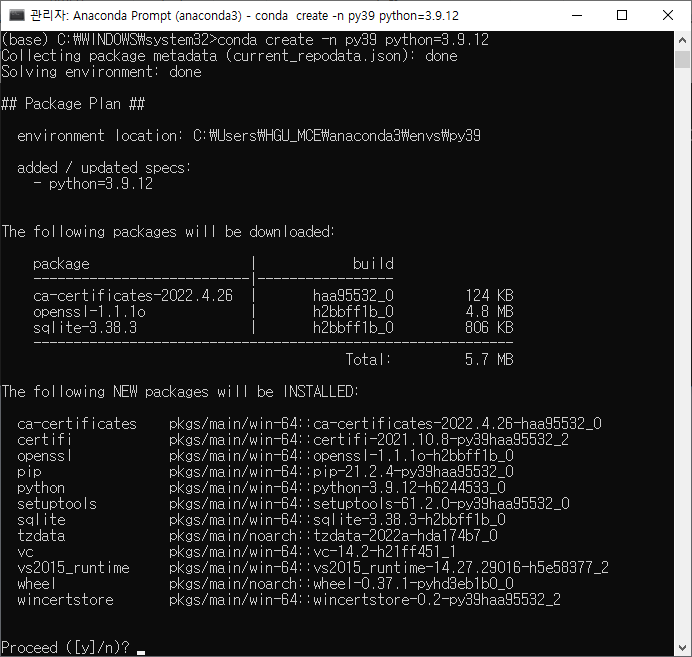

# LAB: Exercise Posture Assistance System

**Date**: 							2022.06.16

**Name**:  						ChangMin An JiWoo Yang

**Github**: 						[Link](https://github.com/ckdals915/DLIP.git)

**Demo Video**: 		  	[Link](https://youtu.be/UxfRx_APDns)


## I. Introduction

In this LAB, we start a project that tells us how to correct our posture in real time when we exercise at the gym. This program is basically limited to the "lat-pull-down" movement. These days, as interest in health increases due to COVID-19, interest in health increases, and people who exercise alone also increase. However, if we exercise alone, it is difficult to recognize whether you are exercising in an accurate posture, and as a result, a problem that is prone to muscle imbalance is found. To solve this problem, we try to create system that identifies each joint of a person and measures the balance according to both slopes of the upper body joint to give feedback on the balance between the two forces. The tutorial is run by visual studio code(VS code), loading web cam or video source, and processing images in real time using OpenCV.


## II. Requirement

### Hardware

* Logitech C922 pro Webcam
* Lat Pull Down Machine

### Software

* Python 3.9.12
* Tensorflow 2.9.1
* numpy 1.21.5
* Matplot 
* OpenCV 4.5.5


## III. Flow Chart


## IV. Procedure

### 1. Setup

First, installation is carried out using Anaconda Prompt to build the environment. It is important to install something suitable for each version using anaconda to build it to enable image processing.


### 2. Installation

#### 2-1. Install Anaconda

**Anaconda** : Python and libraries package installer.

Click here [Download the installer on window ](https://www.anaconda.com/products/distribution#Downloads) to Windows 64-Bit Graphical Installer


Follow the following steps

* Double click the installer to launch.
* Select an install for "Just Me"(recommended)
* Select a destination folder to install Anaconda and click the Next button.
* Do NOT add Anaconda to my PATH environment variable
* Check to register Anaconda as your default Python.


#### 2-2. Install Python

**Python 3.9**

Python is already installed by installing Anaconda. But, we will make a virtual environment for a specific Python version.

* Open Anaconda Prompt(admin mode)


* First, update **conda** and **pip** (If the message "Press Y or N" appears, press Y and Enter key)

```python
# Conda Update
conda update -n base -c defaults conda

# pip Update
python -m pip install --upgrade pip
```


* Then, Create virtual environment for Python 3.9, Name the $ENV as `py39`. If you are in base, enter `conda activate py39`

  ```python
  # Install Python 3.9
  conda create -n py39 python=3.9.12
  ```

  

  

* After installation, activate the newly created environment

```python
# Activate py39
conda activate py39
```


#### 2-3. Install Libs

**Install Numpy, OpenCV, Matplot, Jupyter (opencv-python MUST use 4.5.5 NOT 4.6.0)**

```python
conda activate py39
conda install -c anaconda seaborn jupyter
pip install opencv-python==4.5.5.64
```


#### 2-4. Install Visual Studio Code

Follow: [How to Install VS Code](https://ykkim.gitbook.io/dlip/installation-guide/ide/vscode#installation)

Also, read about

* [How to program Python in VS Code](https://ykkim.gitbook.io/dlip/installation-guide/ide/vscode/python-vscode)


#### 2-5. Install TensorFlow

* **TensorFlow** - DL library, developed by Google.

```python
conda activate py39
pip install tensorflow==2.9.1
```


### 3. Download

* Download MoveNet model: [TFLite model link](https://tfhub.dev/google/lite-model/movenet/singlepose/lightning/3) **(Must download in local folder (include main.py))**


## V. Result


## VI. Analysis


## VII. Reference

* [MoveNet Colab: https://github.com/nicknochnack/MoveNetLightning](https://github.com/nicknochnack/MoveNetLightning)


